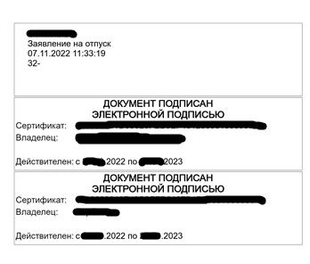

# Доработка визуализации ЭП для 1С:Документооборот государственного учреждения КОРП

В этот раз хочу поделиться с вами решением одной практической задачи для одного из проектов Компании Омега, а именно доработки механизма визуализации электронной подписи, т.к. это потребовало проработки 3-х различных способах взаимодействия со сторонним ПО: работа с com-объектом Word (вставка в .doc), разбор структуры docx и создание картинки для дополнения ЭП и вставки этого добра в pdf.

## Входные данные

Платформы: 8.3.17.2733, 8.3.20.2180 (в ходе проекта платформа обновилась).
Конфигурация: 1С:Документооборот государственного учреждения КОРП. Регион, редакция 2.1 (2.1.31.5).
Версия Word: word 2016

## Постановка задачи

Изменить логику вывода электронной подписи на печать, а именно:

- Исправить ошибки, возникающие при открытии подписанного электронной подписью docx.
- Исправить ошибку вывода электронной подписи в doc (подпись на первом листе и всегда в левом верхнем углу)
- Доработать вывод электронной подписи:
  - ЭП должна всегда выводиться в конце документа на новом листе.
  - Доработка затрагивает следующие форматы: doc, docx и pdf.
  - Должна работать настройка вывода (в каком углу листа выводить ЭП)
  - Перед электронной подписью выводить краткую сопроводительную информацию: вид документа, номер и дату документа (на самом деле реквизитов было больше, но это для статьи не важно).

## Решение

### Минутка эмоций

Ох братцы, сколько было нервов убито на погружение в контекст взаимодействия с каждым из форматов, не передать словами. Особенно когда ты в первый раз видишь строчки типа `oGraphicObject.Left = -999996;` (это значение служебного перечисления Word, говорящее о том, что выравнивание вправо). Сколько времени было убито, чтобы погрузиться в общие представления о методах com-объекта Word, о структуре и способах доработки формата docx, ну и о разборе и сборе pdf внутри платформы...

### Задача 1 - Исправить ошибки, возникающие при открытии подписанного электронной подписью docx

Что делает заложенный в 1С алгоритм вставки изображений? Документ распаковывается как архив, а дальше происходит 2 вещи:

1. В папку `/word/media` закидывается визуализация ЭП
2. В xml-структуру документа вставляется описание и способ вывода этой картинки.

Проблема оказалась на этапе закидывания картинки в общую структуру. Картинка должна иметь имя, по формату `image<ИдКартинки>`, где `ИдКартинки`- это порядковый номер. Алгоритм вставки искал изображения в этой папке, но имя файла там было с большой буквы, а не с маленькой, поэтому id изображений пересекались, что недопустимо. Простенькое решение под спойлером.

Общий модуль: `ВизуализацияЭПВызовСервера.СохранитьИзображениеВоВнутреннейСтруктуреDocx`

```bsl
    #Удаление 
    МассивФайлов = НайтиФайлы(ВременнаяПапкаДляРазархивирования + "/word/media", "Image*.*", Истина);
    
    Для Каждого НайденныйФайл Из МассивФайлов Цикл
        ИДкартинки = ИДкартинки + 1;
    Конеццикла;
    КартинкаШК = Новый Картинка(ДвоичныеДанныеКартинки);
    КартинкаШК.Записать(ВременнаяПапкаДляРазархивирования 
        + "/word/media/Image" + Строка(ИДкартинки + 1) + ".png");
    #КонецУдаления 
    #Вставка 
    МассивФайлов = НайтиФайлы(ВременнаяПапкаДляРазархивирования + "/word/media", "image*.*", Истина);
    Для Каждого НайденныйФайл Из МассивФайлов Цикл
        ИДкартинки = ИДкартинки + 1;
    Конеццикла;
    КартинкаШК = Новый Картинка(ДвоичныеДанныеКартинки);
    КартинкаШК.Записать(ВременнаяПапкаДляРазархивирования 
        + "/word/media/image" + Строка(ИДкартинки + 1) + ".png");
    #КонецВставки
```

### Задача 2 - Исправить ошибку вывода электронной подписи в doc и настроить вывод ЭП на новый лист

В чём суть проблемы? Подпись всегда в левом верхнем углу независимо от настроек программы. Если кратко - не знаю почему, но выравнивание вставленной фигуры oGraphicObject = Док.Shapes.AddTextBox(1, 100, 100, 300, 150) не работает.

Вот тут пришлось зарыться в методы вставки изображений в doc и до сих пор нет уверенности, что найдено самое оптимальное решение. Однако решение рабочее и им можно пользоваться. Код под спойлером.

Общий модуль: `ВизуализацияЭПКлиентСервер.ВставитьКартинкуВФайлDocСУказаниемПоложения`

```bsl
    СмещениеПоГоризонталиЧисло = 0;
    Если СмещениеПоГоризонтали = "MAX" Тогда
        СмещениеПоГоризонталиЧисло = -999996; // служебное число - вправо 
    Иначе
        СмещениеПоГоризонталиЧисло = -999998; // служебное число - влево 
    КонецЕсли;

    СмещениеПоВертикалиЧисло = 0;
    Если СмещениеПоВертикали = "MAX" Тогда
        СмещениеПоВертикалиЧисло = -999997;  // служебное число - низ
    Иначе
        СмещениеПоВертикалиЧисло = -999999; // служебное число - вверх
    КонецЕсли;  
    
    МаксимальноДопустимаяШирина = 200; // по требованию заказчика
    МаксимальноДопустимаяВысота = 150; // по требованию заказчика
    
    rngEndOfDoc = Док.Content; // доступ к данным документа
    rngEndOfDoc.Collapse(0); // переход к концу документа
    rngEndOfDoc.InsertBreak(7); // 7 - вставить именно новый лист
    SelectionWord = WordApp.Selection; // выбрать текущую активную область 
    
    // типовой метод, используемый ранее:
    //oGraphicObject = Док.Shapes.AddTextBox(1, 100, 100, 300, 150);
    // почему то не выравнивается, как бы я не старался, поэтому изменён
    // способ вставки изображения в документ на нижеследующий:
    
    // вставить картинку
    // Коллекция InlineShapes содержит все фигуры, 
    //    которые отображаются в документе, диапазоне или выборе.
    //
    // Параметр1 - путь до картинки
    // Параметр2 - LinkToFile - привязать изображение к файлу
    // Параметр3 - SaveWithDocument - сохранить изображение в документ
    // Параметр4 - Range - местоположение вставленной картинки
    // 
    SHPImage = SelectionWord.InlineShapes.AddPicture(ИмяВременногоФайлаКартинки, False, True, rngEndOfDoc);
    // Преобразует InlineShapes в Shapes.
    // Этот способ честно подсмотрен, но именно такая вставка сработала.
    SHP = SHPImage.ConvertToShape();
    
    SHP.LockAspectRatio = True; // фиксируем масштабирование
    
    // задаём выравнивание по странице
    SHP.Left = СмещениеПоГоризонталиЧисло;
    SHP.RelativeHorizontalPosition = 0;
    SHP.Top = СмещениеПоВертикалиЧисло;
    SHP.RelativeVerticalPosition = 0;
    
    // порядок указани высоты и ширины важен из-за параметра "LockAspectRatio"
    // при изменении высоты автоматически подстроться ширина и наоборот
    // в данном случае главное, чтобы штамп вмещался на страницу поэтому ширина идёт второй
    Если SHP.Height > МаксимальноДопустимаяВысота Тогда
        SHP.Height = МаксимальноДопустимаяВысота;
    КонецЕсли;
    
    Если SHP.Width > МаксимальноДопустимаяШирина Тогда
        SHP.Width = МаксимальноДопустимаяШирина;
    КонецЕсли;
```

P.S. Это единственная функция, которую сделан не через изменение и контроль, а через Вместо, т.к. методика вставки изменена полностью и посчитал некорректным делать это через изменение и контроль.

### Задача 3 - Исправить выравнивание в документе docx и сделать вывод на новом листе

Всё как в реальной жизни, после исправления одной ошибки - появляется другая. Docx стал открывать нормально, но повторилась ситуация как с doc. Выравнивание не работает и вставлять нужно на новый лист.

Тут пришлось сразу несколько мини-доработок сделать:

1. Исправить вставку куска xml-шаблона, чтобы она считалась не от начала документа, а с конца.
2. Исправить масштабирование картинки, т.к. ЭП получалась непропорционально растянутой (коэффициент просто подобрал вручную...).

Общий модуль: `ВизуализацияЭПВызовСервера.ВставитьИзображениеЭПВФайлDocxСУказаниемПоложения`

Оставлены только вставленные кусочки, чтобы не перегружать выводимый код

```bsl
&ИзменениеИКонтроль("ВставитьИзображениеЭПВФайлDocxСУказаниемПоложения")
Функция Расш2_ВставитьИзображениеЭПВФайлDocxСУказаниемПоложения(Расширение, ТекстНадписи, ДвоичныеДанныеФайла, ДвоичныеДанныеКартинки, ПоложениеНаСтранице, ВысотаКартинки)
     
    // ***
    
    //получение макета для вставки регштампа
    #Удаление
    МакетДляВставки = ПолучитьОбщийМакет("ВставкаИзображенияЭПСУказаниемПоложенияDocx");
    #КонецУдаления
    #Вставка
    МакетДляВставки = ПолучитьОбщийМакет("Расш2_ВставкаИзображенияЭПСУказаниемПоложенияDocx");
    #КонецВставки
     
    // ***
    
    #Удаление
    ОтносительночегоСчитатьГоризонтальноеВыравнивание = "page";
    ВертикальноеВыравнивание = "";
    ОтносительноЧегоСчитатьВертикальноеВыравнивание = "page";
     #КонецУдаления
     #Вставка
    // page - это выравнивание по странице, не учитывая границы листа
    // margin - это выравнивание именно по границам листа 
    ОтносительночегоСчитатьГоризонтальноеВыравнивание = "margin";
    ВертикальноеВыравнивание = "";
    ОтносительноЧегоСчитатьВертикальноеВыравнивание = "margin";
    #КонецВставки

    // ***
    
     ТекстДляВставкиШтампа = СтрЗаменить(ТекстДляВставкиШтампа, "_ИДКартинкиВоВнутреннейПапке_", "rId" + Строка(СчетчикСвязей + 1));
    ТекстДляВставкиШтампа = СтрЗаменить(ТекстДляВставкиШтампа, "_ВысотаШтрихкода_", Формат(ВысотаШтрихкода,"ЧДЦ=0; ЧГ=0"));
    #Вставка
    // почему-то типовая ширина ЭП, вставленная в макет, была некоректна
    // подпись получалась очень растянутой, поэтому заменил текст макета на параметр
    // и за 2-3 прохода подобрал нормалаьный коэффициент ширины для ЭП
    //
    ШиринаШтрихкода = ВысотаШтрихкода * 2.5;
    ТекстДляВставкиШтампа = СтрЗаменить(ТекстДляВставкиШтампа, "_ШиринаШтрихкода_", Формат(ШиринаШтрихкода,"ЧДЦ=0; ЧГ=0"));
    #КонецВставки

    // ***
    
    #Удаление
    СтрокаБОДИ = "<w:body>";
    ПозицияТэгаBODY = СтрНайти(ТекстXml, СтрокаБОДИ);
    Если ПозицияТэгаBODY <> 0 Тогда

        ПозицияТэгаBODYКонец = ПозицияТэгаBODY + СтрДлина(СтрокаБОДИ);

        ТекстXml = Лев(ТекстXml, ПозицияТэгаBODYКонец - 1)
        + ТекстДляВставкиШтампа
        + Сред(ТекстXml, ПозицияТэгаBODYКонец);
    КонецЕсли;
     #КонецУдаления
    #Вставка
    // типовая вставка всегда шла в начало страницы, я же пошёл с конца страницы
    
    // для этого ищется признак служебного тэга, который есть в каждом docx документе w:sectPr
    // если я правильно понял, в нём хранятся общие настройки документа (шрифт, размер, выравниванивание и т.д.)
    // он всегда предшествует концу документа и все параграфы должны идти перед ним
    //
    СтрокаSectPr = "<w:sectPr";
    РазрывСтраницы = "
    |<w:p w:rsidR=""00C51609"" w:rsidRPr=""00C51609"" w:rsidRDefault=""002012AA"">
    |    <w:pPr>
    |        <w:pageBreakBefore/>   
    |    </w:pPr>
    |</w:p>";
    
    ПозицияТэгаSectPr = СтрНайти(ТекстXml, СтрокаSectPr, НаправлениеПоиска.СКонца);
    Если ПозицияТэгаSectPr <> 0 Тогда

        ПозицияТэгаSectPrКонец = ПозицияТэгаSectPr;

        ТекстXml = Лев(ТекстXml, ПозицияТэгаSectPrКонец - 1)
        + РазрывСтраницы
        + Сред(ТекстXml, ПозицияТэгаSectPrКонец);
    КонецЕсли;

    ПозицияТэгаSectPr = СтрНайти(ТекстXml, СтрокаSectPr);
    Если ПозицияТэгаSectPr <> 0 Тогда

        ПозицияТэгаSectPrКонец = ПозицияТэгаSectPr;

        ТекстXml = Лев(ТекстXml, ПозицияТэгаSectPrКонец - 1)
        + ТекстДляВставкиШтампа
        + Сред(ТекстXml, ПозицияТэгаSectPrКонец);
    КонецЕсли;
    #КонецВставки

    // ***

КонецФункции
```
​
Макет делал свой т.к. думал, что там многое придётся менять, а изменился способ определения ширины картинки... Но уже править не стал, сроки поджимали.

### Задача 4 - Доработать вывода электронной подписи, чтобы добавилось описание документа

Как устроена вставка электронной подписи в документ? Есть общий макет двоичных данных `ШаблонОтметкиЭП`. Это картинка, на которую выводятся данные электронной подписи средствами специальных программных продуктов (подробнее см. документацию по платформе)

Идея решения проста: делаем то же самое, во только вместо вывода электронной подписи - делаем вывод данных документа. Почему так? Потому что нам нужно доработать вставку в pdf, а в него всё это происходит строго через картинки.

Доработка состоит из двух частей:

1. Доработка общего модуля генерации ЭП
2. Создание процедуры генерации картинки описания ЭП

- сохраняем картинку ЭП в отдельный файл
- удаляем с картинки все надписи, нам нужен только сам прямоугольник с границами
- генерируем картинку по аналогии с ЭП
- учесть, что больше 60 символов на картинку не влезает и если будет очень длинный вид документа, необходимо переносить строку
  
Общий модуль: РаботаСЭП.ОбновитьОтметкуЭП

```bsl
&ИзменениеИКонтроль("ОбновитьОтметкуЭП")
Процедура Расш2_ОбновитьОтметкуЭП(Документ, Файл, ОбъектЭП)

    МассивФайловЭП = Новый Массив;
    #Вставка
    Если ТипЗнч(Документ) = Тип("СправочникСсылка.ВнутренниеДокументы") Тогда
        ПутьКОписаниюДокумента = Расш2_ВизуализацияЭПВспомогательныйВызовСервера.СформироватьОписаниеДокумента(Документ);
        МассивФайловЭП.Добавить(ПутьКОписаниюДокумента);
    КонецЕсли;
    #КонецВставки
    
// дальше идёт типовой код, который нам не важен

КонецПроцедуры
```

Общий модуль: РаботаСКартинками.СформироватьОписаниеДокумента

```bsl
Функция СформироватьОписаниеДокумента(ДанныеОписания) Экспорт
    
    Если ТипЗнч(ДанныеОписания) = Тип("СправочникСсылка.ВнутренниеДокументы") Тогда
        
        ДанныеДляПолучения = Новый Структура;
        ДанныеДляПолучения.Вставить("ВидДокумента", "ВидДокумента.Представление");
        ДанныеДляПолучения.Вставить("ДатаРегистрации", "ДатаРегистрации");
        ДанныеДляПолучения.Вставить("РегистрационныйНомер", "РегистрационныйНомер");
        ДанныеДокумента = ОбщегоНазначения.ЗначенияРеквизитовОбъекта(ДанныеОписания, ДанныеДляПолучения);
        ТекстДляКартинки = СформироватьДополнительныйТекстДляЭП(ДанныеДокумента);
        
    ИначеЕсли ТипЗнч(ДанныеОписания) = Тип("Строка") Тогда

        ТекстДляКартинки = ДанныеОписания;
        
    Иначе
        
        ТекстОшибки = "Ошибка в данных описания электронной подписи. Тип %1 не подлежит обработке.";
        ТекстОшибки = СтрШаблон(ТекстОшибки, ТипЗнч(ДанныеОписания));
        ВызватьИсключение СтрШаблон(ТекстОшибки);
    
    КонецЕсли;
    
    возврат СформироватьОписаниеДокумента(ТекстДляКартинки);

КонецФункции // СформироватьОписаниеДокумента()

// Формирует изображение описания документа
//
// Параметры:
//   ТекстДляКартинки - выводимый текст
//   Формат - Строка - расширение формата.
//
// Возвращаемое значение:
//   Строка - полный путь к картинке штампа ЭП.
//
Функция СформироватьОписаниеДокумента(ТекстДляКартинки, Формат = "PNG") Экспорт
    
    ФайлыКУдалению = Новый Массив;
    
    МакетСертификат = ПолучитьОбщийМакет("Расш2_ШаблонОписанияДокумента");
    
    ПутьФайлаШаблона = ПолучитьИмяВременногоФайла(Формат);
    МакетСертификат.Записать(ПутьФайлаШаблона);
    ФайлыКУдалению.Добавить(ПутьФайлаШаблона);
    
    ПараметрыDraw = Новый Массив;
    
    ПараметрыDraw.Добавить(
        СтрШаблон(
            "text %1, %2 '%3'",
            60,
            60,
            ТекстДляКартинки));
    
    ПараметрыСоздания = Новый Массив;
    
    ПараметрыСоздания.Добавить(
        СтрШаблон("convert %1", ПутьФайлаШаблона));
    
    ПараметрыСоздания.Добавить(
        СтрШаблон(" -pointsize 36 -fill black -draw ""%1""", 
            СтрСоединить(ПараметрыDraw, " ")));
    
    ПараметрыСоздания.Добавить(
        СтрШаблон(
            "-background none -fill black -stroke None -pointsize 36 -size 940x90 -gravity NorthWest caption:""%1"" -geometry +%2+%3 -composite",
            "",
            260,
            150)); // 260 150 - координаты (лево верх)
    
    ПутьНовогоФайла = ПолучитьИмяВременногоФайла("PNG");
    
    ПараметрыСоздания.Добавить(ПутьНовогоФайла);
    
    ПараметрыImageMagick = СтрСоединить(ПараметрыСоздания, " ");
    
    ЗапуститьImageMagick(ПараметрыImageMagick, ФайлыКУдалению);
    
    Возврат ПутьНовогоФайла;
    
КонецФункции

Функция СформироватьДополнительныйТекстДляЭП(Опции) Экспорт
        
    ИтоговыеСтроки = Новый Массив;

    ДобавитьТекстКОписанию(Опции.Организация, ИтоговыеСтроки);
    ДобавитьТекстКОписанию(Опции.ВидДокумента, ИтоговыеСтроки);
    ДобавитьТекстКОписанию(Опции.ДатаРегистрации, ИтоговыеСтроки);
    ДобавитьТекстКОписанию(Опции.РегистрационныйНомер, ИтоговыеСтроки);

    Возврат СтрСоединить(ИтоговыеСтроки, Символы.ПС);
    
КонецФункции

Процедура ДобавитьТекстКОписанию(ДобавляемыйТекст, ИтоговыеСтроки)
    
    Если НЕ ЗначениеЗаполнено(ДобавляемыйТекст) Тогда
    
        Возврат;
    
    КонецЕсли;
    
    Если ТипЗнч(ДобавляемыйТекст) = Тип("Дата") Тогда
        лБуфер = Формат(ДобавляемыйТекст, "ДЛФ=DT");
    Иначе
        лБуфер = Строка(ДобавляемыйТекст);
    КонецЕсли;
    
    ДлинаСтроки = СтрДлина(лБуфер);
    ОграничениеДлины = 60; // больше символов на картинку просто не влезет
    Если ДлинаСтроки < ОграничениеДлины Тогда
        
        ИтоговыеСтроки.Добавить(лБуфер);
        
    Иначе
        
        СтрокиДляОбработки = СтрРазделить(лБуфер, " ");
        СтрокаДляДобавления = "";
        Для каждого ЧастьСтроки Из СтрокиДляОбработки Цикл
            
            РезультатДобавления = СтрокаДляДобавления + ?(СтрокаДляДобавления = "", "", " ") + ЧастьСтроки;
            Если СтрДлина(РезультатДобавления) > ОграничениеДлины Тогда
                
                ИтоговыеСтроки.Добавить(СтрокаДляДобавления);
                СтрокаДляДобавления = ЧастьСтроки;
                
            Иначе
                
                СтрокаДляДобавления = РезультатДобавления;
                
            КонецЕсли;
        
        КонецЦикла;
        
        ИтоговыеСтроки.Добавить(СтрокаДляДобавления);

    КонецЕсли;

КонецПроцедуры
```

### ​Задача 5 - Вывод в pdf

Ну и завершающая часть работы - повторить всё то же самое, но уже для pdf. Вообще вставка в pdf происходит следующим образом:

- Разбор pdf на картинки png
- Проставка штампа электронной подписи на каждую картинку
- Сборка pdf обратно

Новый алгоритм получился попроще:

- Разбор pdf на картинки png
- Добавление в pdf новой картинки фиксированного размера (потому что как сделать картинку такой же, как и прошлый лист, но пустой - я так и не нашёл)
- Вывод на новый лист электронной подписи
- Сборка pdf обратно

Общий модуль: `МодульРаботаСФайламиВызовСервера.ПолучитьВизуализациюЭП`

```bsl
    ИначеЕсли НРег(ДанныеФайла.Расширение) = "pdf" Тогда

        СпособВставкиШтампаЭПВPDF = ПолучитьСпособВставкиШтампаЭПВPDF();

        ВременнаяПапкаДляРазархивирования = ПолучитьИмяВременногоФайла("");

        ДвДанныеФайлаPdf = ПолучитьДвоичныеДанныеФайла(ДанныеФайла.Ссылка);
        ИмяФайлаPdf = ВременнаяПапкаДляРазархивирования + ПолучитьРазделительПути()
        + "src.pdf";
        ДвДанныеФайлаPdf.Записать(ИмяФайлаPdf);

        ДвоичныеДанныеШтампа = ДанныеФайла.ДвоичныеДанныеШтампа;
        ИмяФайлаШтампа = ВременнаяПапкаДляРазархивирования + ПолучитьРазделительПути()
        + "stamp.png";
        ДвоичныеДанныеШтампа.Записать(ИмяФайлаШтампа);

        Если СпособВставкиШтампаЭПВPDF = Перечисления.СпособыВставкиШтампаЭПВPDF.ImageMagickGhostscript Тогда
            РаботаСКартинками.УменьшитьШтамп(ИмяФайлаШтампа, ЧислоПодписей);
        Иначе    
            РаботаСКартинками.УвеличитьШтамп(ИмяФайлаШтампа, ЧислоПодписей);
        КонецЕсли;    

        РасположениеШтампаЭПВPdf = ПолучитьРасположениеШтампаЭПВPdf();

        ИмяФайлаPdfНовое = ВременнаяПапкаДляРазархивирования + ПолучитьРазделительПути()
        + "new.pdf";
        Если СпособВставкиШтампаЭПВPDF = Перечисления.СпособыВставкиШтампаЭПВPDF.ImageMagickGhostscript Тогда

            МассивПутейPng = РаботаСКартинками.ПреобразоватьPdfВPng(ИмяФайлаPdf, ВременнаяПапкаДляРазархивирования);
            МассивНовыхPng = Новый Массив;

            Счетчик = 1;
            Для Каждого ПутьPng Из МассивПутейPng Цикл

                #Удаление
                НовыйПутьPng = РаботаСКартинками.НаложитьШтамп(
                ПутьPng, ИмяФайлаШтампа, ВременнаяПапкаДляРазархивирования, Счетчик,
                РасположениеШтампаЭПВPdf);
                МассивНовыхPng.Добавить(НовыйПутьPng);
                Счетчик = Счетчик + 1;
                  #КонецУдаления 

                #Вставка
                МассивНовыхPng.Добавить(ПутьPng);
                Счетчик = Счетчик + 1;
                #КонецВставки 
            
            КонецЦикла;    
               #Вставка
            ПустаяКартинка = БиблиотекаКартинок.Расш2_ПустойЛист;
            ПустаяКартинкаПуть = ВременнаяПапкаДляРазархивирования + ПолучитьРазделительПути()
            + "end.png";
            ПустаяКартинка.Записать(ПустаяКартинкаПуть);
            НовыйПутьPng = РаботаСКартинками.НаложитьШтамп(
                ПустаяКартинкаПуть, ИмяФайлаШтампа, ВременнаяПапкаДляРазархивирования, Счетчик,
                РасположениеШтампаЭПВPdf);
            МассивНовыхPng.Добавить(НовыйПутьPng);
            #КонецВставки 

            ИмяBatФайла = ВременнаяПапкаДляРазархивирования + ПолучитьРазделительПути()
            + "cnv.bat";
            РаботаСКартинками.ПреобразоватьPngВPdf(МассивНовыхPng, ИмяФайлаPdfНовое,
            ИмяBatФайла);

            Для Каждого ФайлКУдалению Из МассивНовыхPng Цикл
                УдалитьФайлы(ФайлКУдалению);
            КонецЦикла;


        Иначе // тут средствами платформы    

            НомерШтампа = 0;

            КопироватьФайл(ИмяФайлаPdf, ИмяФайлаPdfНовое); 

            ЗаписьPDF = Новый ЗаписьPDF(ИмяФайлаPdfНовое);

            КартинкаШтампа = Новый Картинка(ИмяФайлаШтампа);

            опис = Новый ОписаниеОтображаемогоОбъектаPDF;

            опис.Имя = "Пример";

            опис.Объект = КартинкаШтампа;

            опис.НомерСтраницы = 1;

            //А4  210 297 мм

            ВысотаШтампаММ = 24;
            ШиринаШтампаММ = 96;

            Если РасположениеШтампаЭПВPdf = Перечисления.ВариантыПечатиШтампаЭП.ЛевыйВерхний Тогда
                опис.Лево = 0;
                опис.Верх =  5 + ВысотаШтампаММ * НомерШтампа;
            ИначеЕсли РасположениеШтампаЭПВPdf = Перечисления.ВариантыПечатиШтампаЭП.ЛевыйНижний Тогда
                опис.Лево = 0;
                опис.Верх =  297 - (ВысотаШтампаММ + ВысотаШтампаММ * НомерШтампа);
            ИначеЕсли РасположениеШтампаЭПВPdf = Перечисления.ВариантыПечатиШтампаЭП.ПравыйВерхний Тогда
                опис.Лево = 210 - ШиринаШтампаММ;
                опис.Верх =  5 + ВысотаШтампаММ * НомерШтампа;
            ИначеЕсли РасположениеШтампаЭПВPdf = Перечисления.ВариантыПечатиШтампаЭП.ПравыйНижний Тогда
                опис.Лево = 210 - ШиринаШтампаММ;
                опис.Верх =  297 - (ВысотаШтампаММ + ВысотаШтампаММ * НомерШтампа);
            КонецЕсли;    

            ЗаписьPDF.ЗаписатьОтображаемыйОбъект(опис); 

            ЗаписьPDF.Закрыть();

        КонецЕсли;

        ДвоичныеДанныеНовые = Новый ДвоичныеДанные(ИмяФайлаPdfНовое);
        ФайлВизуализация = РаботаСФайламиВызовСервера.СоздатьВизуализациюИЗаполнитьДанныеФайла(
        ДанныеФайла, ДвоичныеДанныеНовые, ИдентификаторФормы);    

        УдалитьФайлы(ВременнаяПапкаДляРазархивирования);

    КонецЕсли;
```

## Результат работы

Теперь электронные подписи выводятся в следующем формате



## Заключение

Ну вот собственно и всё. Коллегам из компании Омега спасибо, что разрешили поделиться материалом. Обобщить и выложить способ решения данной задачи захотелось исходя из двух соображений:

1. Решение узкоспециализированных задач быстро забывается, а так останется какой-никакой, но конспект о решении. И если вдруг когда-то задача повторится - будет проще.
2. Такая задача может возникнуть не у меня одного и коллегам будет от чего оттолкнуться. Как говорят великие: "мы стоим на плечах гигантов".

Спасибо за то, что уделили внимание моим запискам. С уважением, Вдовенко Сергей.
