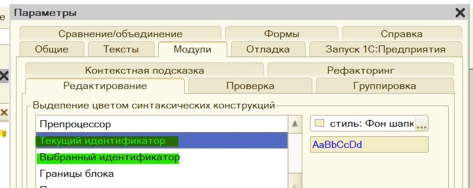
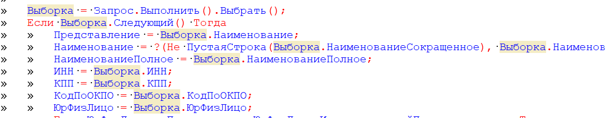
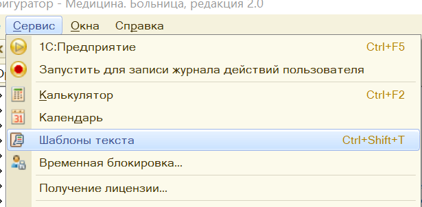
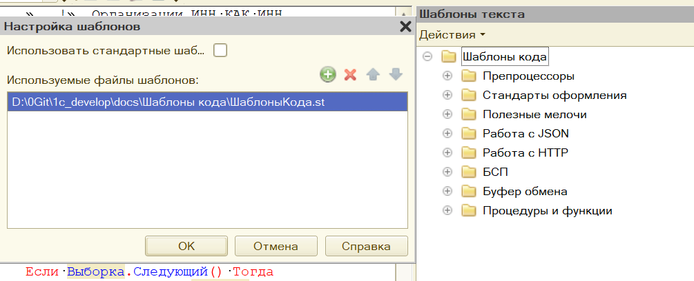
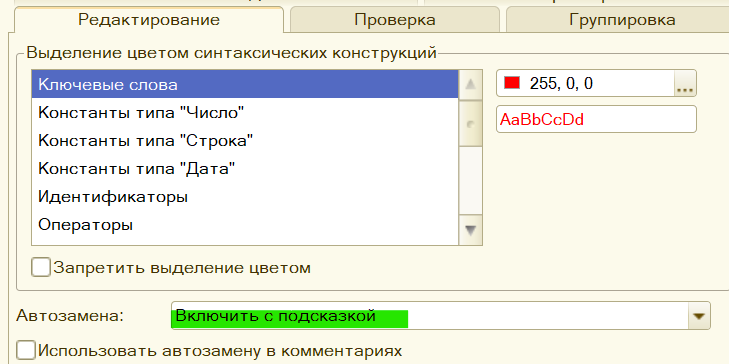
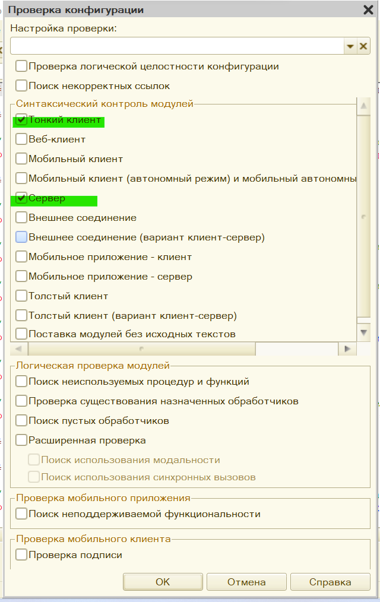
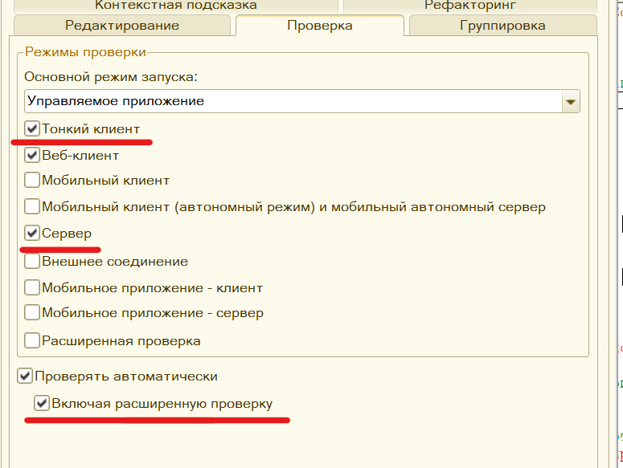
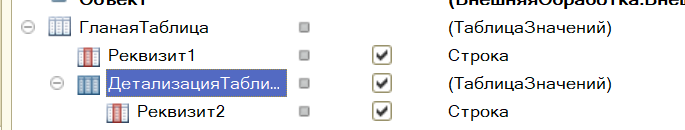
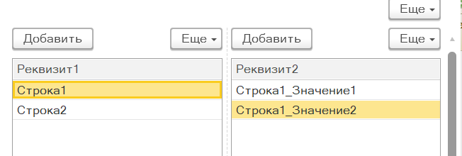
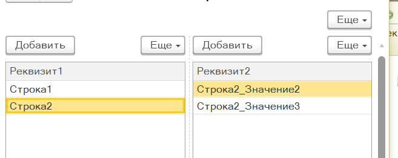

# Маленькие хитрости большой платформы (часть 1)

Ничего сверхсекретного, просто несколько полезных приёмов, как упростить себе жизнь и ускорить разработку: от банальных советов до неочевидных, на первый взгляд, приёмов.

## Простые хитрости

Очевидные и простые советы, которые могут показаться банальными, но напомнить про них лишним никогда не будет.  

### Подсветка идентификаторов

Если используете платформу 8.3.+, то этот совет для вас. Какую бы цветовую схемы не использовали - обязательно включайте подсветку идентификаторов: текущий и выбранный (см. скриншоты).





### Свои шаблоны

**Кому будет полезен совет?** Если приходится работать на разных клиентских ПК, где ещё и стоят запреты на флешки, файлы и т.д. - тогда не стоит заморачиваться своими шаблонами, а лучше как раз выучить типовые.

Шаблоны, как мне видится, у каждого программиста свои. Они подбираются под специфику работы, стиль программирования, требования конкретной организации к оформлению кода и т.д. Исходя из своего опыта, хочу дать 2 рекомендации:

1. Сразу отключить стандартные шаблоны, наиболее удобные из них перенести себе в файл

    

    

2. Включить для своих шаблонов настройку автозаполнение

    

## Хитрости со звёздочкой

Далее идут практики, которые могут спасти от ошибок объединения конфигураций или помогут обнаружиться неочевидные ошибки в коде или в доставшемся legacy.

### Проверка конфигурации

Данную процедуру стоит проводить перед каждой заливкой в хранилище. Особенно актуальная она для тех, кто занимается обновлением нетиповых конфигураций или ведёт разветвлённую разработку с периодическим слиянием хранилищ.

В меню "Конфигурации" есть такой полезный метод: "Проверка конфигурации". Там множество настроек, на которых я сильно останавливаться не буду, покажу общий принцип: сделали обновление, поставили нужные настройки и проверяете релиз. Это убережёт от банальных ошибок объединения, когда не перенеслась или перенеслась с ошибкой какая-нибудь функция.



### Расширенная проверка синтаксиса модуля

Цитата из документации: "Расширенная проверка. Выполняется проверка обращений к методам и свойствам объектов "через точку" (для ограниченного набора типов)."

Это совет применим ограниченно, т.к. если у вас очень тяжёлое legacy или очень большая конфигурация (н-р ERP и выше) - то эта проверка будет скорее мешать, чем помогать. Остальным советую сразу эту проверку включать. Делается это в следующем разделе:



Подчеркнутые красным пункты (кроме расширенной проверки) нужно включать всегда, чтобы потом не было мучительно больно.

## Продвинутые хитрости

Ну и ближе к концу 2 совета, которые либо неочевидны изначально, либо выгода от которых изначально не ясна.

### Вложенные таблицы на управляемой форме

Довольно часто встречается задача, добавить на форму связанные табличные части, н-р: в таблице 1 выбирается номенклатура, а в таблице 2 - отображаются партии номенклатуры, характеристики и т.д..

Часто встречаемый путь реализации - это 2 независимые таблицы на форме и работа с событиями "При активации строки" / "Выбор". Но есть и более интересный и просто приём для реализации этой связи. Тут проще 1 раз показать, чем много расписывать.







### Управление 1С из командной строки

Преимуществ от освоение работы с 1С из командной строки масса:

1. Самое простое: авторизация в конфигуратор и хранилище без необходимости вводить всё при каждом запуске руками

    ```bat
    rem  пример авторизации в базу и в хранилище
    "C:\Program Files\1cv8\8.3.18.1334\bin\1cv8.exe" DESIGNER  /f"D:\Work\1c_bases\" /N"Пользователь" /P"Пароль" /ConfigurationRepositoryF"D:\Work\1c_hran" /ConfigurationRepositoryN "Администратор" /ConfigurationRepositoryP "123"
    ```

2. И до самого сложного: скрипты, автоматизирующие обновление конфигураций, резервное копирование и т.д. Сразу оговорюсь: да, есть инструменты-надстройки над командной строкой 1С, такие как vrunner, но иметь базовое понимание о командах самой 1С нужно, ибо не у каждого клиента и не на каждом ПК можно будет поставить oScript или другое любое другое ПО.

## Заключение

На этом, пожалуй, на сегодня закончу. Была мысль в декабре что-то более глубокое посмотреть (н-р: асинхронность в 8.3.21), но, к сожалению, злобный вирус подкосил, поэтому ограничусь данным материалом. Надеюсь, он был чем-то да полезен. Спасибо всем за внимание и с наступающим 2023 годом!

Спасибо за то, что уделили внимание моим запискам. С уважением, Вдовенко Сергей.
