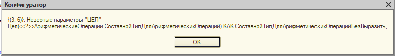
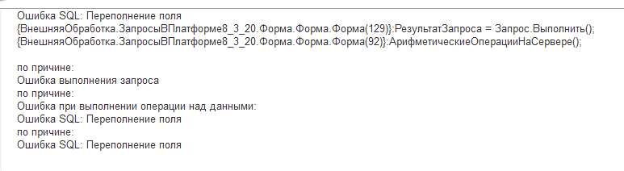
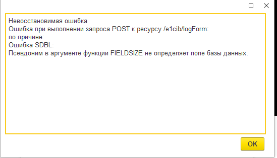
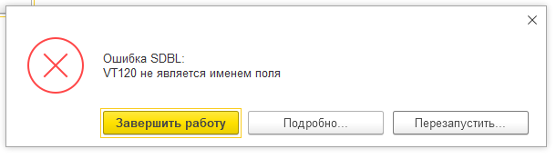

# Новые возможности языка запросов в платформе 8.3.20

С платформы 8.3.20 анонсировали ряд изменений в языке запросов, с которыми интересно было повозиться на практике, что и было проделано. Результатом этих изысканий решил поделиться с вами.

## Анонсированные возможности (кратко)

Анонс новых возможностей можно посмотреть по [ссылке](https://wonderland.v8.1c.ru/blog/novye-funktsii-yazyka-zaprosov-i-sistemy-komponovki-dannykh/), если кратко, можно выделить три больших блока добавлений:

- Добавлены новые арифметические операции: округление, логарифмы, квадратные корни и т.д.
- Добавлена возможность преобразования в строку и расширение работы со строками: обрезка строк, удаление пробелов и т.д.
- Добавлена возможность получать размер хранимых данных через метод `РазмерХранимыхДанных`.

Вот со всем этим и хотелось познакомится поподробнее. Все эксперименты проводились на платформе 8.3.20.1613.

## Арифметические возможности

В платформе анонсировали следующие возможности:

- Тригонометрические функции `Sin`, `Cos`, `Tan`, `ASin`, `ACos`, `ATan` (все вычисления производятся в радианах)
- `Exp` - вычисляет результат возведения основания натурального логарифма (числа e) в степень
- `Log` - вычисляет натуральный логарифм числа.
- `Log10` - вычисляет десятичный логарифм числа.
- `Pow` - вычисляет возведение в степень.
- `Sqrt` – вычисляет квадратный корень.
- `Окр(Round)` - округляет исходное число до нужной разрядности
- `Цел(Int)` - вычисляет целую часть переданного числа, полностью отсекая дробную часть.

### Код проверки

Для проверки сделан следующий тестовый пример:

Добавлен справочник "АрифметическиеОперации" - с полями разных типов, чтобы проверить возможности неявного преобразования и составного типа.
Написана соответствующая обработка и запрос к данным. Все строки, которые помещены в комментарий - не проходили компиляцию.

```bsl
&НаСервере
Процедура АрифметическиеОперацииНаСервере()

    Запрос = Новый Запрос;
    Запрос.Текст = 
    "ВЫБРАТЬ
    |    АрифметическиеОперации.Ссылка КАК Ссылка,
    //|    Цел(АрифметическиеОперации.СоставнойТипДляАрифметическихОпераций) КАК СоставнойТипДляАрифметическихОперацийБезВыразить,
    |    Цел(ВЫРАЗИТЬ(АрифметическиеОперации.СоставнойТипДляАрифметическихОпераций КАК ЧИСЛО (10,0))) КАК ЦелСоставноеПоле,
    |    Цел(АрифметическиеОперации.Число) КАК Цел,
    //|    Цел(АрифметическиеОперации.НеЧисло) КАК ЦелНеЧисло,
    //|    Цел(NULL) КАК ЦелNULL,
    //|    Цел(Неопределено) КАК ЦелНеопределено, 
    |    Exp(АрифметическиеОперации.Число) КАК Exp,
    |    Log(АрифметическиеОперации.Число) КАК Log,
    |    Log10(АрифметическиеОперации.Число) КАК Log10,
    |    Pow(АрифметическиеОперации.Число, 2) КАК Pow,
    |    Sqrt(АрифметическиеОперации.Число) КАК Sqrt,
    |    Окр(АрифметическиеОперации.Число, 2) КАК Окр
    |ИЗ
    |    Справочник.АрифметическиеОперации КАК АрифметическиеОперации";
    
    РезультатЗапроса = Запрос.Выполнить();
    
    Выборка = РезультатЗапроса.Выбрать();
    Сообщение = Новый СообщениеПользователю;
    данныеСообщения = Новый Структура("ЦелСоставноеПоле, Цел, Exp, Log, Log10, Pow, Sqrt, Окр");
    Пока Выборка.Следующий() Цикл
        
        ЗаполнитьЗначенияСвойств(данныеСообщения, Выборка);
        Сообщение.Текст = СтрШаблон("Результат вычисления:
            | Цел (составное поле): %1,
            | Цел: %2,
            | Exp: %3,
            | Log: %4,
            | Log10: %5,
            | Pow: %6,
            | Sqrt: %7, 
            | Окр: %8", 
            данныеСообщения.ЦелСоставноеПоле,
            данныеСообщения.Цел,
            данныеСообщения.Exp,
            данныеСообщения.Log,
            данныеСообщения.Log10,
            данныеСообщения.Pow,
            данныеСообщения.Sqrt,
            данныеСообщения.Окр);
        Сообщение.Сообщить();
        
    КонецЦикла;
    
КонецПроцедуры
```

Выявлены следующие особенности:

- Данные операторы работают строго с числами. При попадании туда любого другого значения, включая  NULL или Неопределено - платформа выдаст ошибку.


- Данные операторы не могут работать с полями составного типа без явного приведения к числу (оператор `ВЫРАЗИТЬ`).



- В арифметических операциях можно влететь в невозможность вычислить выражение из-за слишком большого числа. Ошибка ниже возникла при попытке посчитать `exp` от 500. Попытки вставить `ВЫРАЗИТЬ` и т.д. ни к чему не привели.



В целом с арифметическим операциями всё - переходим к работе со строками.

## Работа со строками

В платформе анонсировали следующие возможности:

- Строка(String) – преобразует значение примитивного типа в строку с учетом национальных установок.
- ДлинаСтроки(StringLength) – вычисляет длину строки.
- СокрЛ(TrimL) – отбрасывает незначащие пробелы слева.
- СокрП(TrimR) – отбрасывает незначащие пробелы справа.
- СокрЛП(TrimAll) – отбрасывает незначащие пробелы слева и справа.
- Лев(Left) – получает первые слева символы строки.
- Прав(Right) – получает первые справа символы строки.
- СтрНайти(StrFind) – находит первую позицию подстроки в строке (без учета регистра).
- ВРег(Upper) – преобразует все символы строки в верхний регистр.
- НРег(Lower) – преобразует все символы строки в нижний регистр.
- СтрЗаменить(StrReplace) – заменяет все вхождения подстроки на другую подстроку (без учета регистра).

В данном случае будет 2 эксперимента, т.к. функцию Строка хотелось погонять "в хвост и в гриву".

### Код проверки работы с простыми типами

```bsl
&НаСервере
Процедура РаботаСоСтрокамиНаСервере_Строка()
    
    Запрос = Новый Запрос;
    Запрос.Текст = 
        "ВЫБРАТЬ
        |    1 КАК Исходник,
        |    СТРОКА(1) КАК Результат
        |
        |ОБЪЕДИНИТЬ ВСЕ
        |
        |ВЫБРАТЬ
        |    ""строка"",
        |    СТРОКА(""строка"")
        |
        |ОБЪЕДИНИТЬ ВСЕ
        |
        |ВЫБРАТЬ
        |    ИСТИНА,
        |    СТРОКА(ИСТИНА)
        |
        |ОБЪЕДИНИТЬ ВСЕ
        |
        |ВЫБРАТЬ
        |    ДАТАВРЕМЯ(2022, 2, 2),
        |    СТРОКА(ДАТАВРЕМЯ(2022, 2, 2))
        |
        |ОБЪЕДИНИТЬ ВСЕ
        |
        |ВЫБРАТЬ
        |    NULL,
        |    СТРОКА(NULL)
        |
        |ОБЪЕДИНИТЬ ВСЕ
        |
        |ВЫБРАТЬ
        |    НЕОПРЕДЕЛЕНО,
        |    СТРОКА(НЕОПРЕДЕЛЕНО)
        |
        |ОБЪЕДИНИТЬ ВСЕ
        |
        |ВЫБРАТЬ
        |    ВЫРАЗИТЬ(РаботаСоСтроками.СтрокаНеограниченнойДлины КАК СТРОКА(50)),
        |    СТРОКА(РаботаСоСтроками.СтрокаНеограниченнойДлины)
        |ИЗ
        |    Справочник.РаботаСоСтроками КАК РаботаСоСтроками
        |
        |ОБЪЕДИНИТЬ ВСЕ
        |
        |ВЫБРАТЬ
        |    РаботаСоСтроками.СтрокаСПробеламиВНачалеИКонце,
        |    СТРОКА(РаботаСоСтроками.СтрокаСПробеламиВНачалеИКонце)
        |ИЗ
        |    Справочник.РаботаСоСтроками КАК РаботаСоСтроками";
    
    РезультатЗапроса = Запрос.Выполнить();
    ОбойтиРезультатЗапроса(РезультатЗапроса);
        
КонецПроцедуры
```

Выявлены следующие особенности:

- Умеет преобразовывать любые примитивные типы, включая `NULL` или `Неопределено` (см. пример).

- Не умеет преобразовывать ссылки на объекты, в том числе предопределённые элементы.


- Если использовать функцию `Строка` на строку неограниченной длинны - запрос спокойно отработает. Ради интереса вставил в реквизит текст первого тома "Война и мир" - запрос выполнился без вопросов и в результате получил весь текст из реквизита.

### Код проверки работы со строковыми реквизитами

Для проверки используем уже созданный справочник `РаботаСоСтроками`.

```bsl
&НаСервере
Процедура РаботаСоСтрокамиНаСервере_ЧисловыеДанные()

    Запрос = Новый Запрос;
    Запрос.Текст = 
        "ВЫБРАТЬ
        |    ВЫРАЗИТЬ(РаботаСоСтроками.СтрокаНеограниченнойДлины КАК СТРОКА(50)) КАК Исходник,
        |    ""ДлинаСтроки_НеогрДлина"" КАК Функция,
        |    ДлинаСтроки(РаботаСоСтроками.СтрокаНеограниченнойДлины) КАК Результат
        |ИЗ
        |    Справочник.РаботаСоСтроками КАК РаботаСоСтроками
        |
        |ОБЪЕДИНИТЬ ВСЕ
        |
        |ВЫБРАТЬ
        |    РаботаСоСтроками.СтрокаСПробеламиВНачалеИКонце,
        |    ""ДлинаСтроки_ОгрДлина"" КАК Функция,
        |    ДлинаСтроки(РаботаСоСтроками.СтрокаСПробеламиВНачалеИКонце)
        |ИЗ
        |    Справочник.РаботаСоСтроками КАК РаботаСоСтроками
        |
        |ОБЪЕДИНИТЬ ВСЕ
        |
        |ВЫБРАТЬ
        |    ВЫРАЗИТЬ(РаботаСоСтроками.СтрокаНеограниченнойДлины КАК СТРОКА(50)),
        |    ""СтрНайти_НеогрДлина"",
        |    СтрНайти(РаботаСоСтроками.СтрокаНеограниченнойДлины, ""Безухов"")
        |ИЗ
        |    Справочник.РаботаСоСтроками КАК РаботаСоСтроками
        |
        |ОБЪЕДИНИТЬ ВСЕ
        |
        |ВЫБРАТЬ
        |    РаботаСоСтроками.СтрокаСПробеламиВНачалеИКонце,
        |    ""СтрНайти_ОгрДлина"",
        |    СтрНайти(РаботаСоСтроками.СтрокаСПробеламиВНачалеИКонце, ""513"")
        |ИЗ
        |    Справочник.РаботаСоСтроками КАК РаботаСоСтроками";
    
    РезультатЗапроса = Запрос.Выполнить();
    ОбойтиРезультатЗапроса(РезультатЗапроса);
    
КонецПроцедуры
 
&НаСервере
Процедура РаботаСоСтрокамиНаСервере_СтроковыеДанные()

    Запрос = Новый Запрос;
    Запрос.Текст = 
        "ВЫБРАТЬ
        |    ВЫРАЗИТЬ(РаботаСоСтроками.СтрокаНеограниченнойДлины КАК СТРОКА(50)) КАК Исходник,
        |    ""СокрЛ_НеогрДлина"" КАК Функция,
        |    СокрЛ(РаботаСоСтроками.СтрокаНеограниченнойДлины) КАК Результат
        |ИЗ
        |    Справочник.РаботаСоСтроками КАК РаботаСоСтроками
        |
        |ОБЪЕДИНИТЬ ВСЕ
        |
        |ВЫБРАТЬ
        |    РаботаСоСтроками.СтрокаСПробеламиВНачалеИКонце,
        |    ""СокрЛ_ОгрДлина"" КАК Функция,
        |    СокрЛ(РаботаСоСтроками.СтрокаСПробеламиВНачалеИКонце)
        |ИЗ
        |    Справочник.РаботаСоСтроками КАК РаботаСоСтроками
        |
        |ОБЪЕДИНИТЬ ВСЕ
        |
        |ВЫБРАТЬ
        |    ВЫРАЗИТЬ(РаботаСоСтроками.СтрокаНеограниченнойДлины КАК СТРОКА(50)),
        |    ""СокрП_НеогрДлина"",
        |    СокрП(РаботаСоСтроками.СтрокаНеограниченнойДлины)
        |ИЗ
        |    Справочник.РаботаСоСтроками КАК РаботаСоСтроками
        |
        |ОБЪЕДИНИТЬ ВСЕ
        |
        |ВЫБРАТЬ
        |    РаботаСоСтроками.СтрокаСПробеламиВНачалеИКонце,
        |    ""СокрП_ОгрДлина"" КАК Функция,
        |    СокрП(РаботаСоСтроками.СтрокаСПробеламиВНачалеИКонце)
        |ИЗ
        |    Справочник.РаботаСоСтроками КАК РаботаСоСтроками
        |
        |
        |ОБЪЕДИНИТЬ ВСЕ
        |
        |ВЫБРАТЬ
        |    ВЫРАЗИТЬ(РаботаСоСтроками.СтрокаНеограниченнойДлины КАК СТРОКА(50)),
        |    ""СокрЛП_НеогрДлина"",
        |    СокрЛП(РаботаСоСтроками.СтрокаНеограниченнойДлины)
        |ИЗ
        |    Справочник.РаботаСоСтроками КАК РаботаСоСтроками
        |
        |ОБЪЕДИНИТЬ ВСЕ
        |
        |ВЫБРАТЬ
        |    РаботаСоСтроками.СтрокаСПробеламиВНачалеИКонце,
        |    ""СокрЛП_ОгрДлина"" КАК Функция,
        |    СокрЛП(РаботаСоСтроками.СтрокаСПробеламиВНачалеИКонце)
        |ИЗ
        |    Справочник.РаботаСоСтроками КАК РаботаСоСтроками
        |
        |ОБЪЕДИНИТЬ ВСЕ
        |
        |ВЫБРАТЬ
        |    ВЫРАЗИТЬ(РаботаСоСтроками.СтрокаНеограниченнойДлины КАК СТРОКА(50)),
        |    ""Лев_НеогрДлина"",
        |    ЛЕВ(РаботаСоСтроками.СтрокаНеограниченнойДлины, 5)
        |ИЗ
        |    Справочник.РаботаСоСтроками КАК РаботаСоСтроками
        |
        |ОБЪЕДИНИТЬ ВСЕ
        |
        |ВЫБРАТЬ
        |    РаботаСоСтроками.СтрокаСПробеламиВНачалеИКонце,
        |    ""Лев_ОгрДлина"",
        |    ЛЕВ(РаботаСоСтроками.СтрокаСПробеламиВНачалеИКонце, 5)
        |ИЗ
        |    Справочник.РаботаСоСтроками КАК РаботаСоСтроками
        |
        |ОБЪЕДИНИТЬ ВСЕ
        |
        |ВЫБРАТЬ
        |    ВЫРАЗИТЬ(РаботаСоСтроками.СтрокаНеограниченнойДлины КАК СТРОКА(50)),
        |    ""Прав_НеогрДлина"",
        |    Прав(РаботаСоСтроками.СтрокаНеограниченнойДлины, 5)
        |ИЗ
        |    Справочник.РаботаСоСтроками КАК РаботаСоСтроками
        |
        |ОБЪЕДИНИТЬ ВСЕ
        |
        |ВЫБРАТЬ
        |    РаботаСоСтроками.СтрокаСПробеламиВНачалеИКонце,
        |    ""Прав_ОгрДлина"",
        |    Прав(РаботаСоСтроками.СтрокаСПробеламиВНачалеИКонце, 5)
        |ИЗ
        |    Справочник.РаботаСоСтроками КАК РаботаСоСтроками
        |
        |ОБЪЕДИНИТЬ ВСЕ
        |
        |ВЫБРАТЬ
        |    ВЫРАЗИТЬ(РаботаСоСтроками.СтрокаНеограниченнойДлины КАК СТРОКА(50)),
        |    ""ВРег_НеогрДлина"",
        |    ВРег(РаботаСоСтроками.СтрокаНеограниченнойДлины)
        |ИЗ
        |    Справочник.РаботаСоСтроками КАК РаботаСоСтроками
        |
        |ОБЪЕДИНИТЬ ВСЕ
        |
        |ВЫБРАТЬ
        |    РаботаСоСтроками.СтрокаСПробеламиВНачалеИКонце,
        |    ""ВРег_ОгрДлина"",
        |    ВРег(РаботаСоСтроками.СтрокаСПробеламиВНачалеИКонце)
        |ИЗ
        |    Справочник.РаботаСоСтроками КАК РаботаСоСтроками
        |
        |ОБЪЕДИНИТЬ ВСЕ
        |
        |ВЫБРАТЬ
        |    ВЫРАЗИТЬ(РаботаСоСтроками.СтрокаНеограниченнойДлины КАК СТРОКА(50)),
        |    ""НРег_НеогрДлина"",
        |    НРег(РаботаСоСтроками.СтрокаНеограниченнойДлины)
        |ИЗ
        |    Справочник.РаботаСоСтроками КАК РаботаСоСтроками
        |
        |ОБЪЕДИНИТЬ ВСЕ
        |
        |ВЫБРАТЬ
        |    РаботаСоСтроками.СтрокаСПробеламиВНачалеИКонце,
        |    ""НРег_ОгрДлина"",
        |    НРег(РаботаСоСтроками.СтрокаСПробеламиВНачалеИКонце)
        |ИЗ
        |    Справочник.РаботаСоСтроками КАК РаботаСоСтроками";
    
    РезультатЗапроса = Запрос.Выполнить();
    ОбойтиРезультатЗапроса(РезультатЗапроса);
    
КонецПроцедуры
```

Выявлены следующие особенности:

- Остальные функции отказываются работать с любыми типами, кроме `Строка`
- Все эти функции умеют работать со строками неограниченной длинны.
- Конструктор ловить лишь часть ошибок по типизации, а часть вылезет только на клиенте.
- В запросе можно объединить операторы `СтрДлина` и `СокрЛП` / `СокрЛ` / `СокрП` (число и строка). Код, приведённый ниже  - полностью рабочий. А вот объединить `СтрДлина` и `Лев` уже невозможно. Конструктор ошибку может и не выдать, а вот при выполнении на клиенте ошибка будет точно.

```bsl
&НаСервере
Процедура РаботаСоСтроками_ПримерОбъединенияНаСервере()

    Запрос = Новый Запрос;
    Запрос.Текст = 
        "ВЫБРАТЬ
        |    РаботаСоСтроками.СтрокаСПробеламиВНачалеИКонце КАК СтрокаСПробеламиВНачалеИКонце,
        |    ""ДлинаСтроки_ОгрДлина"" КАК Функция,
        |    ДЛИНАСТРОКИ(РаботаСоСтроками.СтрокаСПробеламиВНачалеИКонце) КАК Результат
        |ИЗ
        |    Справочник.РаботаСоСтроками КАК РаботаСоСтроками
        |
        |ОБЪЕДИНИТЬ ВСЕ
        |
        |ВЫБРАТЬ
        |    РаботаСоСтроками.СтрокаСПробеламиВНачалеИКонце,
        |    ""СокрЛ_ОгрДлина"",
        |    СОКРЛ(РаботаСоСтроками.СтрокаСПробеламиВНачалеИКонце)
        |ИЗ
        |    Справочник.РаботаСоСтроками КАК РаботаСоСтроками";
    
    РезультатЗапроса = Запрос.Выполнить();
    ОбойтиРезультатЗапроса(РезультатЗапроса);
    
КонецПроцедуры
```

## Функция `РазмерХранимыхДанных`

В платформе анонсировали следующие возможности:

> РазмерХранимыхДанных(StoredDataSize) – возвращает размер данных в байтах, которые занимают данные параметра.

Данная функция будет применима не только к хранилищу значений (как почему-то подумалось мне изначально), а к любому существующему в базе реквизиту (ну, почти к любому).

### Код проверки хранимых данных

Для проверки сделан следующий тестовый пример:

- Добавлен справочник `РазмерХранимыхДанных` - с полями разных типов и табличной частью.

```bsl
&НаСервере
Процедура РазмерХранимыхДанныхНаСервере()

    Запрос = Новый Запрос;
    
    // Поля, приводящие к ошибке
    //|    РАЗМЕРХРАНИМЫХДАННЫХ(РазмерХранимыхДанных.ТаблицаРеквизитов) КАК ТаблицаРеквизитов, // в конструкторе - ошибки нет, в пользовательском - есть
    //|    РАЗМЕРХРАНИМЫХДАННЫХ(РазмерХранимыхДанных.Представление) КАК Представление, // ошибка и в конструкторе и в пользовательском режиме
    //|    РАЗМЕРХРАНИМЫХДАННЫХ(РазмерХранимыхДанных.Предопределенный) КАК Предопределенный, // ошибка в пользовательском режиме, в констукторе - ошибки нет
    
    Запрос.Текст = 
        "ВЫБРАТЬ
        |    ""РХД_Ссылка"" КАК Функция,
        |    РАЗМЕРХРАНИМЫХДАННЫХ(РазмерХранимыхДанных.Ссылка) КАК Результат
        |ИЗ
        |    Справочник.РазмерХранимыхДанных КАК РазмерХранимыхДанных
        |
        |ОБЪЕДИНИТЬ ВСЕ
        |
        |ВЫБРАТЬ
        |    ""РХД_СтрокаНеограниченнойДлины"",
        |    РАЗМЕРХРАНИМЫХДАННЫХ(РазмерХранимыхДанных.СтрокаНеограниченнойДлины)
        |ИЗ
        |    Справочник.РазмерХранимыхДанных КАК РазмерХранимыхДанных
        |
        |ОБЪЕДИНИТЬ ВСЕ
        |
        |ВЫБРАТЬ
        |    ""РХД_ХранилищеЗначения"",
        |    РАЗМЕРХРАНИМЫХДАННЫХ(РазмерХранимыхДанных.ХранилищеЗначения)
        |ИЗ
        |    Справочник.РазмерХранимыхДанных КАК РазмерХранимыхДанных";
    
    РезультатЗапроса = Запрос.Выполнить();
    ОбойтиРезультатЗапроса(РезультатЗапроса);
    
КонецПроцедуры
```

Выявлены следующие особенности:

- Любая ошибка с размером хранимых данных приводит к вылету платформы



- Надо чётко понимать, что является реквизитом ИБ, а что нет, т.к. подсказка в конструкторе работает далеко не всегда. (Н-р: попытка обращения к полям `Представление` , `Предопределённый` - приведут к ошибке (см. пример проверки)).

- Получить общий размер табличной части таким образом не получится, что собственно следует из определения, но проверить нужно было.



## Заключение

Доклад окончен. Целью статьи было попробовать для себя и показать другим как работают новые возможности языка запросов, какие есть при этом ограничения и нюансы, о которых можно изначально не подумать. Если вдруг кому нужна обработка, в которой я накидывал данные примеры кода - см. мой [github](https://github.com/zeltyr/articles/tree/main/src/2022/Новые%20возможности%20запросов%208.3.20)

Спасибо за то, что уделили внимание моим запискам. С уважением, Вдовенко Сергей.
