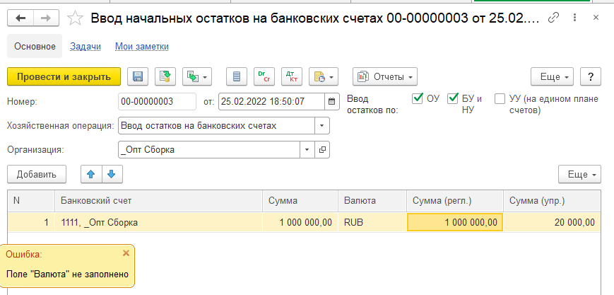
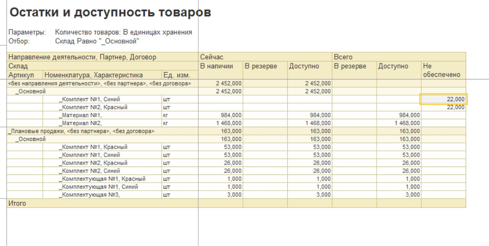
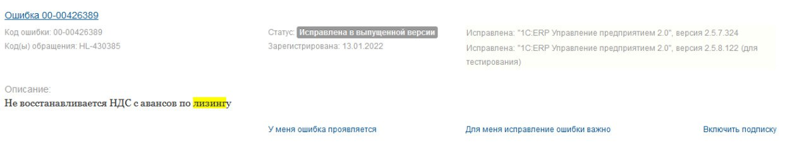
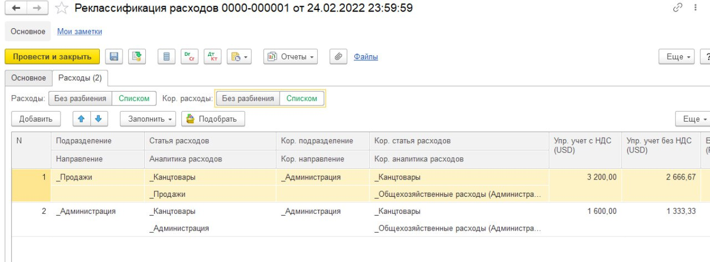

# Ошибки релиза ERP 2.5.7.226, мешающие сдать экзамен специалист-консультант, и способы их преодоления

Захотелось зачем-то сдать экзамен специалист-консультант по управленческому учёту в ERP. И в процессе подготовки наткнулся на ряд досадных ошибок релиза, на обход которых было потрачено порядочно времени. Надеюсь, эта информация будет полезна тем, кто только начал подготовку.

## Ошибка документа ввода начальных остатков

Во всех задачах требуется ввести начальные данные, яркий пример - остатки на расчётных счетах. Сказано - делаем. Переходим к документам ввода начальных остатков, создаём и заполняем новый документ, нажимает "Провести и закрыть", и тут "Поле "Валюта" не заполнено"... Шта?

Что делать? Самое простое - сдавать в демо-базе и копировать существующий документ, перезаполняя его своими данными. В телеграм-канале по подготовке советовали "Попробуйте отключить настройку "насколько валют"", но я с этим не игрался и не знаю, помогает это или нет.

## Не проставляются цены, при использовании источника "Цены номенклатуры"

В сквозном примере по 2.4 есть блок, где необходимо подтянуть цены в план продаж. Но повторяя все действия за преподавателем и настраивая всё 1 в 1 как у него цены почему-то упорно отказывались попадать в документ. Я упорный, поэтому полез смотреть логику проведения документа "Изменения цен" и СКД запрос. И что же я увидел?

Схема компоновки смотрит в регистр сведений "ЦеныНоменклатуры". А документ "ИзменениеЦен" пишет в регистр сведений "ЦеныНоменклатуры25"... Ну, на этом мои полномочия всё.

Что делать? Настройте схему заполнение данных, а цену просто внесите руками. А в пояснительной записке можно оставить примечание с упоминанием этого бага.

## Ошибка обеспечения заказа, когда в роли назначения используется направление деятельности без обособления

В курсе по 2.4 в примерном билете 2 направления деятельности: "Плановые продажи" и "Обособленные продажи". Согласно указаниям преподавателя, во всех документах (планирование, сборка, заказ клиента) для плановых продаж проставляется направления деятельности. Тогда товар будет в резерве по этому направлению и может быть отгружен только через него.

Повторяем все действия, пытаемся отгрузить заказ клиента, а программа нам и говорит: а товара-то нет... Открываем отчет "Остатки и доступность товаров" и что ж мы видим? Заказ клиента почему-то ожидает свободный и не зарезервированный ни под что остаток (несмотря на то, что в нём указано направление деятельности), а на складе собранные комплекты оказались зарезервированы под направление. Возможно есть какие-то настройки, которыми это можно победить - но я таковых не нашёл.

Что делать? Не надо использовать в качестве никакие назначения, кроме обособления. Обособление и обеспечение под него работает вполне корректно и к этому претензий нет. Не отрабатывает схема, когда мы без обособления указываем направление деятельности.

## Ошибка восстановления НДС по документам лизинга

На экзамене есть 2 варианта приобретения основных средств: аренда или лизинг. То, что написано далее касается лизинга, только лизинга и ничего кроме лизинга. Оформляем договор, вводим все положенные документы, смотрим в управленческий баланс... А он у расходится на сумму НДС. Что же случилось, неужели что-то забыл или неверно ввёл? А нет, просто баг

Что делать? Делать договор лизинга без НДС, в пояснительной записке описываем всю свою боль.

## Ошибка распределения по объекту возникновения затрат (ОВЗ) при списании ТМЦ на затраты

Ох ОВЗ, ОВЗ... Сколько нервов было убито в попытке освоить и понять (и принять) как работает эта технология. Останавливаться на том что это такое и зачем, я не буду.

Сразу скажу, когда происходит поступление услуг, распределение работает хорошо. Единственное, чего не стоит делать, так это пытаться распределить из ОВЗ по одной организации в ОВЗ с другой организацией. Там какой-то ахтунг происходит... Сразу успокою, это я игрался, подобной экзаменационной задачи не видел.

А если всё работает, то когда возникает проблема? А вот тогда, когда встречается подобное задание: "списать закупленные канцтовары на подразделение "Администрация" и разделить их на подразделения по пропорции: 2/3 на "Продажи" и 1/3 на "Администрация", после чего с этих подразделений всё отразить на фин. результат текущего периода". И беда в том, что повторяя все те же самые действия, что работали для услуг ничего не взлетает. Совсем.

Что делать? На момент написания статьи, сработало только оформление документа "Реклассификация расходов", где принудительно расписано первичное распределение.

## Заключение

На этом у меня всё. Надеюсь этот материал вам поможет и сбережёт время при подготовке к данному экзамену.

Спасибо за то, что уделили внимание моим запискам. С уважением, Вдовенко Сергей.
