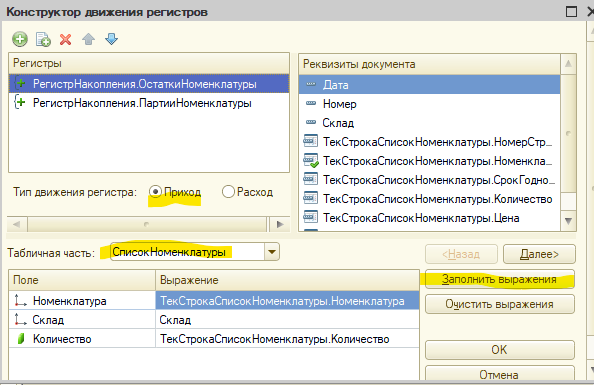
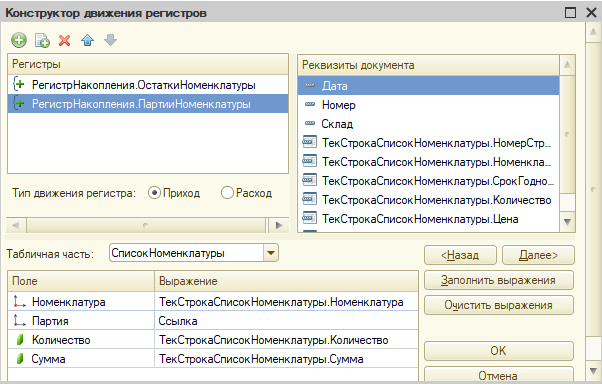
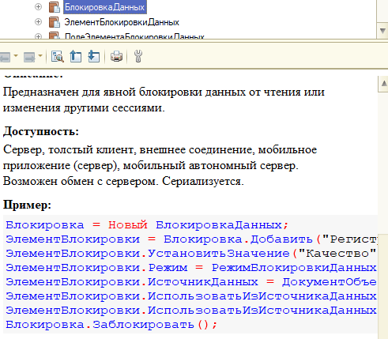
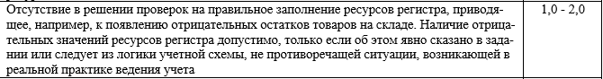
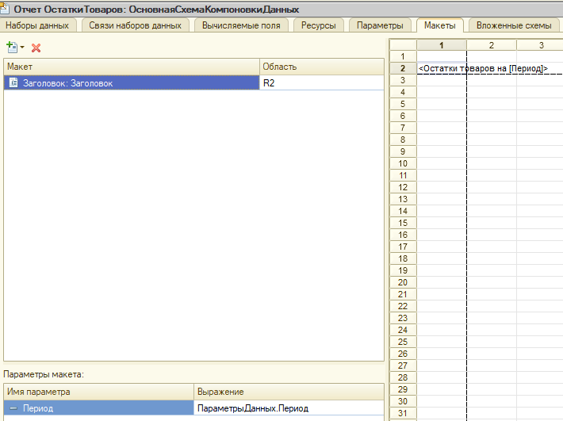
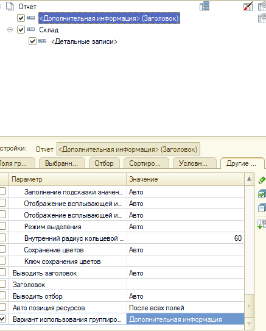
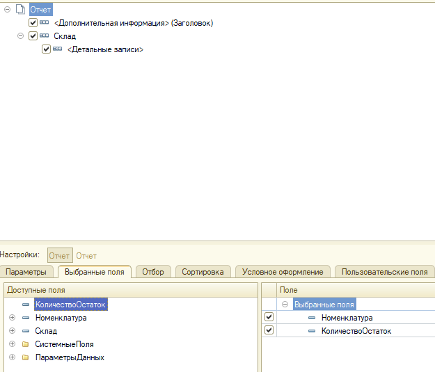
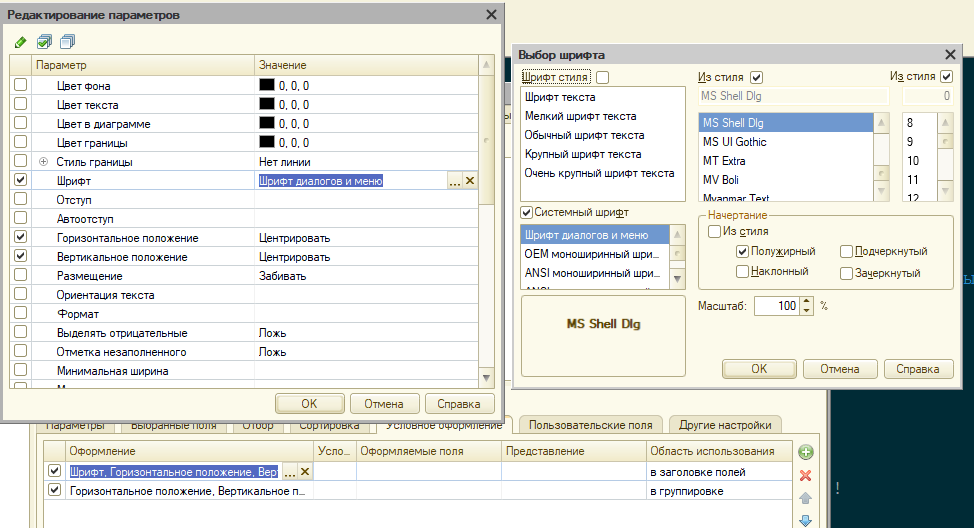
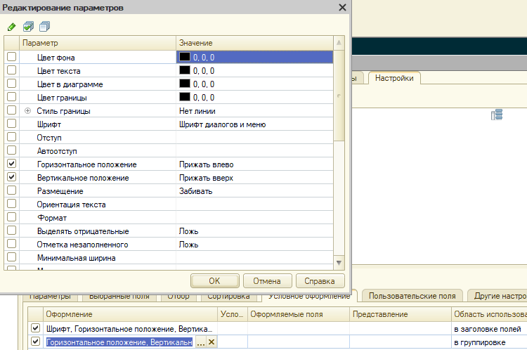

# Пример решения задачи по оперативному учету для экзамена (1С: Специалист по платформе 8.3)

Готовясь к повторной сдаче экзамена 1С:Специалист по платформе, получил просьбу от коллег - расписать решение нескольких билетов, чтобы было проще понять логику и ход решения. Сделав описание одного - двух билетов, выложил всё это на github и оставил до поры до времени. Недавно наткнулся и стало жалко, если тот труд пропадёт зря, поэтому решил выложить одно решение в виде статьи и прикрепить к нему ссылку на github, вдруг ещё кому данный материал будет полезен.

**Дисклеймер.** Данные записи, по сути, практическая выжимка решения, теор. часть практически не разбирается! Поэтому важен теоретических базис от любого доступного источника: Курс 1С УЦ, Курс Гилёва, Курс Чистова, практическое пособие разработчика и т.д.

## Краткая справка

### Флаг движений регистра Записывать: `Движения.ОстаткиНоменклатуры.Записывать = Истина`

- Если установлен в `ИСТИНА` означает, что по завершении процедуры проведения движения по этому регистру будут записаны в БД
- Особенность программной записи:

```bsl
   Движения.Записать(); // снимает флаг "Записывать" 
   Движения.ОстаткиНоменклатуры.Записать(); // НЕ снимает флаг "Записывать"
```

### Старая и новая методики проведения для контроля остатков

- Старая методика (блокировка более длительная)
  
  - Ставим блокировку
  - Читаем записи регистра
  - Обходим результат:
    - если остатков не хватает - зажигаем флаг ОТКАЗ и выводим ошибки
    - Если всё хорошо - заполняем движения

- Новая методика (блокировка менее длительная)

  - Заполняем движения
  - ставим флаг (Движения.ОстаткиНоменклатуры.БлокироватьДляИзменения = Истина) и делаем запись
    - подробнее про флаг см. статью: [что на самом деле делает `БлокироватьДляИзменения`](https://infostart.ru/1c/articles/196565/). За исправление спасибо коллеге [@pablo_escobar](https://infostart.ru/profile/118824/)
  - Делам запрос к БД с поиском отрицательных остатков
    - если есть отрицательные остатки - зажигаем флаг `Отказ` и выводим ошибки
    - если всё хорошо - делать ничего не надо
  - Всегда надо пытаться применить новую методику (меньше времени ожидания на блокировках), но это далеко не всегда возможно
    - Как быстро выбрать методику? *Если данные регистра нужны для формирования движений - старая методика, иначе - новая методика*.

### Зачем нужна конструкция языка с записью движений первый раз при старой методике?

```bsl
 Движения.ОстаткиНоменклатуры.Записывать = Истина;
 Движения.ОстаткиНоменклатуры.Записать();
```

Без этого не удалятся старые движения документа при перепроведении, а это ошибка в решении билетов. Подробнее смотрите теорию из любого доступного источника

### Не забываем разносить объекты по подсистемам

Все объекты решения всегда должны быть включены в соответствующую подсистему и разнесены по группам (см. базовые настройки конфигурации...). Делается это перед началом тестирования решения, т.к. все объекты метаданных уже будут созданы

## Работаем с билетом

### Текст билета

Компания занимается оптовой торговлей. Поступление товара отражается документом «Приходная накладная», продажа – «Расходная накладная». Помимо продажи товара, могут оказываться дополнительные услуги, например по доставке. И услуги и товары указываются в одной табличной части.

Учет товаров ведется в разрезе складов. Поступление и продажа осуществляется с указанием склада (в шапке документа).

При проведении документа «Расходная накладная» необходимо производить списание товара со склада. В том случае, когда товара не хватает, документ проводиться не должен.

Списание себестоимости товаров должно быть организовано по партиям, в зависимости от метода списания (FIFO или LIFO), принятого в учетной политике. Значение учетной политики меняется не чаще одного раза в год. При проведении документа необходимо использовать метод, актуальный на момент проведения.

Для расчета себестоимости при списании товара необходимо учитывать только момент поступления товара в компанию, вне зависимости от того, на какой склад он пришел. Предположим, для метода списания FIFO первое поступление портсигара произошло на склад «Основной» документом «Приходная накладная №1», а потом на склад «Транзитный» документом «Приходная накладная №2». В этом случае при продаже товара со склада «Транзитный» в первую очередь должна быть списана себестоимость портсигара по документу «Приходная накладная №1», так как она пришла раньше.

Необходимо построить отчет по остаткам товара на складах на указанную дату.

Остатки товаров на 01.01.2010

|Склад|Номенклатура|Кол-во|
|---|---|---|
|Основной|||
||Куртка замшевая|2|
||Портсигар|2|
|Транзитный|||
||Куртка замшевая|5|
||Кинокамера|1|

### Анализ решения

Выделяем ключевые особенности решения 1-2 словами, чтобы потом по этому чек-листу разрабатывать решение

Используемые документы: "Приходная накладная", "Расходная накладная"

- Есть услуги в одной ТЧ
- Учет в разрезе складов / склад в шапке
- Требуется проверка остатков при списании
- Метод списания (Fifo, lifo) раз в год
- Себестоимость списывается без учёта склада
- Отчет простой, строится по одному регистру

Каждая особенность влияет на решение и настройку метаданных

**Проектирование регистра начинается с анализа отчета!**

## Ход решения билета

### Подготовка объектов метаданных

- Добавляем реквизит "Вид номенклатуры" для справочника "Номенклатура"

  - Имя "ВидНоменклатуры" (тип: "ПеречислениеСсылка.ВидНоменклатуры" или булево)
  - требуется для "Есть услуги в одной ТЧ"

- Создаём новый справочник "Склады"

  - Создаём 2 предопределённых склада: "Основной" и "Транзитный"
  - требуется для Учет в разрезе складов / склад в шапке

- Дорабатываем учётные документы

  - Создаём реквизит шапки "Склад" (тип: "СправочникСсылка.Склады") в используемых документах
    - Не забываем ставить признак Проверка заполнения в Выдавать ошибку
    - Для опер. учёт всё, но если почитать весь билет, то увидим, что в табличной части будет доп. разрез по срокам годности - его можно добавить сразу
    - Требуется для Учет в разрезе складов / склад в шапке

- Добавляем периодический регистр сведений "Учетная политика"

  - Период: Год
  - Измерения: нет, Ресурсы Метод списания (тип: ПеречислениеСсылка.УчетнаяПолитика)

- Настраиваем регистр "ОстаткиНоменклатуры"

  - Измерение "Номенклатура"
    - Ставим признак "Запрет незаполненных значений"
  - Добавляем измерение "Склад" (тип: "СправочникСсылка.Склады")
    - Ставим признак "Запрет незаполненных значений"
  - Регистраторы:
    - "ПриходнаяНакладная", "РасходнаяНакладная"
  - Включаем режим разделения итогов (последняя вкладка)
  - Требуется для Учет в разрезе складов / склад в шапке

- Добавляем новый регистр "ПартииНоменклатуры"

  - Измерения:
    - Номенклатура (тип: СправочникСсылка.Номенклатура)
    - Партия (тип: ДокументСсылка.ПриходнаяНакладная)
  - Ресурсы:
    - Количество (тип: Число, длина: 10, точность: 0)
    - Сумма (тип: Число, длина: 12, точность: 2) // по-умолчанию сумму считаем в рублях
  - Регистраторы:
    - "ПриходнаяНакладная", "РасходнаяНакладная"
  - Проверяем что включен режим разделения итогов (последняя вкладка)
  - Требуется для Себестоимость списывается без учёта склада

### Настройка документа "Приходная накладная"

Для ускорения процесса первичные движения всегда накидываем через конструктор движений





- Результат

```bsl
    // регистр ОстаткиНоменклатуры Приход
    Движения.ОстаткиНоменклатуры.Записывать = Истина;
    Для Каждого ТекСтрокаСписокНоменклатуры Из СписокНоменклатуры Цикл
        Движение = Движения.ОстаткиНоменклатуры.Добавить();
        Движение.ВидДвижения = ВидДвиженияНакопления.Приход;
        Движение.Период = Дата;
        Движение.Номенклатура = ТекСтрокаСписокНоменклатуры.Номенклатура;
        Движение.Склад = Склад;
        Движение.Количество = ТекСтрокаСписокНоменклатуры.Количество;
    КонецЦикла;

    // регистр ПартииНоменклатуры Приход
    Движения.ПартииНоменклатуры.Записывать = Истина;
    Для Каждого ТекСтрокаСписокНоменклатуры Из СписокНоменклатуры Цикл
        Движение = Движения.ПартииНоменклатуры.Добавить();
        Движение.ВидДвижения = ВидДвиженияНакопления.Приход;
        Движение.Период = Дата;
        Движение.Номенклатура = ТекСтрокаСписокНоменклатуры.Номенклатура;
        Движение.Партия = Ссылка;
        Движение.Количество = ТекСтрокаСписокНоменклатуры.Количество;
        Движение.Сумма = ТекСтрокаСписокНоменклатуры.Сумма;
    КонецЦикла;
```

- Дорабатываем алгоритм, чтобы отфильтровать услуги

```bsl
    Движения.ОстаткиНоменклатуры.Записывать = Истина;
    Движения.ПартииНоменклатуры.Записывать = Истина;

    Запрос = Новый Запрос;
    Запрос.Текст = 
    "ВЫБРАТЬ
    |    ПриходнаяНакладнаяСписокНоменклатуры.Номенклатура КАК Номенклатура,
    |    СУММА(ПриходнаяНакладнаяСписокНоменклатуры.Количество) КАК Количество,
    |    СУММА(ПриходнаяНакладнаяСписокНоменклатуры.Сумма) КАК Сумма
    |ИЗ
    |    Документ.ПриходнаяНакладная.СписокНоменклатуры КАК ПриходнаяНакладнаяСписокНоменклатуры
    |ГДЕ
    |    ПриходнаяНакладнаяСписокНоменклатуры.Ссылка = &Ссылка
    |    И ПриходнаяНакладнаяСписокНоменклатуры.Номенклатура.ВидНоменклатуры = ЗНАЧЕНИЕ(Перечисление.ВидыНоменклатуры.Товар)
    |
    |СГРУППИРОВАТЬ ПО
    |    ПриходнаяНакладнаяСписокНоменклатуры.Номенклатура";

    Запрос.УстановитьПараметр("Ссылка", Ссылка);

    РезультатЗапроса = Запрос.Выполнить();

    Выборка = РезультатЗапроса.Выбрать();

    Пока Выборка.Следующий() Цикл

        Движение = Движения.ОстаткиНоменклатуры.Добавить();
        Движение.ВидДвижения = ВидДвиженияНакопления.Приход;
        Движение.Период = Дата;
        Движение.Номенклатура = Выборка.Номенклатура;
        Движение.Склад = Склад;
        Движение.Количество = Выборка.Количество;

        Движение = Движения.ПартииНоменклатуры.Добавить();
        Движение.ВидДвижения = ВидДвиженияНакопления.Приход;
        Движение.Период = Дата;
        Движение.Номенклатура = Выборка.Номенклатура;
        Движение.Партия = Ссылка;
        Движение.Количество = Выборка.Количество;
        Движение.Сумма = Выборка.Сумма;

    КонецЦикла;
```

### Настройка документа "Расходная накладная"

- Для ускорения процесса первичные движения всегда накидываем через конструктор движений
  - тут я их уже показывать не будут - полная аналогии с тем, что раньше, только вид движения "Расход"

- Ключевые точки алгоритма

  - Получить учетную политику
    - Если метода нет - выдать ошибку и не проводить документ
    - требуется для Метод списания (Fifo, lifo) раз в год
  - Поставить признак записи и очистить прошлые записи регистра
    - это критически важно для корректного перепроведения документов
  - Определить методику проведения для каждого регистра
    - `ПартииНоменклатуры` - старая методика, т.к. нужны данные регистра (стоимость партии) для формирования движений
      - ставим блокировку БлокировкаДанных по измерению `Номенклатура` с отбором по ТЧ
читаем партии на `МоментВремени`
      - проверяем, что кол-ва хватает, если нет ОТКАЗ = истина и вывод ошибок (не забываем про Представление)
      - Если хватает - заполняем движения
    - `ОстаткиНоменклатуры` - новая методика, т.к. все данные есть в документе и других не надо
      - заполняем движения
      - ставим флаг "БлокироватьДляИзменения"
      - записываем движения
      - читаем регистр на Границу документа с поиском отрицательных остатков
      - Если есть отрицательные остатки, ОТКАЗ = истина и вывод ошибок (не забываем про Представление)
  - Сделать движения по регистру `Партии номенклатуры` (старая методика)
    - Если нужно списывать партии - их ВСЕГДА надо сортировать по моменту времени, если явно не задан другой критерий
      - Fifo - по возрастанию
      - lifo - по убыванию
    - При списании не забываем решать проблему копеек
      - кратко: 3 шт. стоимостью 100 рублей = 33.33 за штуку // обратный расчет: 33.33 * 3 = 99.99 // вот это проблема копеек
      - Способ решения: при списании последней штучки списывать ВСЮ оставшуюся себестоимость (один из универсальных способов приведён в коде)
    - **Совет.** Обратите внимание на переменную "КоличествоСписать": она важна
    - **Полезный приём!** по-умолчанию сортируйтесь по убыванию, а при необходимости просто убирайте слово "УБЫВ"
    - **полезный приём!** Кусок кода с блокировкой можно копировать из справки! Пишите слово `БлокировкаДанных` и `ctrl+F1`
      

  - Сделать движения по регистру `Остатки номенклатуры` (новая методика)

    - все пояснения по методике списания есть выше
    - по методике решения от 1С даже при отказе надо вывести ВСЕ ошибки, поэтому движения по 2м регистрам делаются независимо от того есть в одном ошибка или нет
    - в билете может не быть явного указания на контроль остатков, но такое есть в общих требованиях к экзамену!

      

```bsl
    УчетнаяПолитика = РегистрыСведений.УчетнаяПолитика.СрезПоследних(МоментВремени());
    Если УчетнаяПолитика.Количество() = 0 Тогда

        Отказ = Истина;

    Иначе

        МетодСписания = УчетнаяПолитика[0].МетодСписания;
        Если НЕ ЗначениеЗаполнено(МетодСписания) Тогда
            Отказ = Истина;
        КонецЕсли;

    КонецЕсли;

    Если Отказ Тогда

        Сообщение = Новый СообщениеПользователю;
        Сообщение.Текст = "Не задана учетная политика!";
        Сообщение.Сообщить();
        Возврат;

    КонецЕсли;

    Движения.ПартииНоменклатуры.Записывать = Истина;
    Движения.ПартииНоменклатуры.Записать();

    Блокировка = Новый БлокировкаДанных;
    ЭлементБлокировки = Блокировка.Добавить("РегистрНакопления.ПартииНоменклатуры");
    ЭлементБлокировки.Режим = РежимБлокировкиДанных.Исключительный;
    ЭлементБлокировки.ИсточникДанных = СписокНоменклатуры;
    ЭлементБлокировки.ИспользоватьИзИсточникаДанных("Номенклатура", "Номенклатура");
    Блокировка.Заблокировать();    

    // для контроля остатков используем регистр "Остатки" и новую методику
    Запрос = Новый Запрос;
    Запрос.МенеджерВременныхТаблиц = Новый МенеджерВременныхТаблиц;
    Запрос.Текст = 
    "ВЫБРАТЬ
    |    &Склад КАК Склад,
    |    РасходнаяНакладнаяСписокНоменклатуры.Номенклатура КАК Номенклатура,
    |    СУММА(РасходнаяНакладнаяСписокНоменклатуры.Количество) КАК Количество,
    |    СУММА(РасходнаяНакладнаяСписокНоменклатуры.Сумма) КАК Сумма
    |ПОМЕСТИТЬ ВТ_ДанныеДок
    |ИЗ
    |    Документ.РасходнаяНакладная.СписокНоменклатуры КАК РасходнаяНакладнаяСписокНоменклатуры
    |ГДЕ
    |    РасходнаяНакладнаяСписокНоменклатуры.Ссылка = &Ссылка
    |    И РасходнаяНакладнаяСписокНоменклатуры.Номенклатура.ВидНоменклатуры = &ВидНоменклатуры
    |
    |СГРУППИРОВАТЬ ПО
    |    РасходнаяНакладнаяСписокНоменклатуры.Номенклатура
    |
    |ИНДЕКСИРОВАТЬ ПО
    |    Номенклатура,
    |    Склад
    |;
    |
    |////////////////////////////////////////////////////////////////////////////////
    |ВЫБРАТЬ
    |    ВТ_ДанныеДок.Склад КАК Склад,
    |    ВТ_ДанныеДок.Номенклатура КАК Номенклатура,
    |    ВТ_ДанныеДок.Количество КАК Количество,
    |    ПартииНоменклатурыОстатки.Партия КАК Партия,
    |    ЕСТЬNULL(ПартииНоменклатурыОстатки.КоличествоОстаток, 0) КАК КоличествоПартии,
    |    ЕСТЬNULL(ПартииНоменклатурыОстатки.СуммаОстаток, 0) КАК СуммаПартии,
    |    ВТ_ДанныеДок.Номенклатура.Представление КАК НоменклатураПредставление
    |ИЗ
    |    ВТ_ДанныеДок КАК ВТ_ДанныеДок
    |        ЛЕВОЕ СОЕДИНЕНИЕ РегистрНакопления.ПартииНоменклатуры.Остатки(
    |                &МоментВремени,
    |                Номенклатура В
    |                    (ВЫБРАТЬ РАЗЛИЧНЫЕ
    |                        ВТ_ДанныеДок.Номенклатура КАК Номенклатура
    |                    ИЗ
    |                        ВТ_ДанныеДок КАК ВТ_ДанныеДок)) КАК ПартииНоменклатурыОстатки
    |        ПО ВТ_ДанныеДок.Номенклатура = ПартииНоменклатурыОстатки.Номенклатура
    |
    |УПОРЯДОЧИТЬ ПО
    |    ПартииНоменклатурыОстатки.Партия.МоментВремени УБЫВ
    |ИТОГИ
    |    МАКСИМУМ(Количество),
    |    СУММА(КоличествоПартии)
    |ПО
    |    Номенклатура";

    Запрос.УстановитьПараметр("ВидНоменклатуры", Перечисления.ВидыНоменклатуры.Товар);
    Запрос.УстановитьПараметр("МоментВремени", МоментВремени());
    Запрос.УстановитьПараметр("Ссылка", Ссылка);
    Запрос.УстановитьПараметр("Склад", Склад);

    Если МетодСписания = Перечисления.УчетнаяПолитика.ФИФО Тогда
        Запрос.Текст = СтрЗаменить(Запрос.Текст, ".МоментВремени УБЫВ", ".МоментВремени");
    КонецЕсли;

    РезультатЗапроса = Запрос.Выполнить();

    ВыборкаНоменклатура = РезультатЗапроса.Выбрать(ОбходРезультатаЗапроса.ПоГруппировкам);

    Пока ВыборкаНоменклатура.Следующий() Цикл

        Движение = Движения.ОстаткиНоменклатуры.Добавить();
        Движение.ВидДвижения = ВидДвиженияНакопления.Расход;
        Движение.Период = Дата;
        Движение.Номенклатура = ВыборкаНоменклатура.Номенклатура;
        Движение.Склад = Склад;
        Движение.Количество = ВыборкаНоменклатура.Количество;

        НеХватает = ВыборкаНоменклатура.Количество - ВыборкаНоменклатура.КоличествоПартии;
        Если НеХватает > 0 Тогда
            Отказ = Истина;
            Сообщение = Новый СообщениеПользователю;
            Сообщение.Текст = "Не хватает товара: " + ВыборкаНоменклатура.НоменклатураПредставление + " по партиям в количестве: " + НеХватает;
            Сообщение.Сообщить();
        КонецЕсли;

        Если Отказ Тогда 
            Продолжить;
        КонецЕсли;

        ВыборкаДетальныеЗаписи = ВыборкаНоменклатура.Выбрать();

        КоличествоСписать = ВыборкаНоменклатура.Количество;

        Пока КоличествоСписать > 0 И ВыборкаДетальныеЗаписи.Следующий() Цикл

            КолПоПартии = МИН(КоличествоСписать, ВыборкаДетальныеЗаписи.КоличествоПартии);
            Себестоимость = ?(КолПоПартии = ВыборкаДетальныеЗаписи.КоличествоПартии, 
              ВыборкаДетальныеЗаписи.СуммаПартии, 
              КолПоПартии * ВыборкаДетальныеЗаписи.СуммаПартии / ВыборкаДетальныеЗаписи.КоличествоПартии);

            Движение = Движения.ПартииНоменклатуры.Добавить();
            Движение.ВидДвижения = ВидДвиженияНакопления.Расход;
            Движение.Период = Дата;
            Движение.Номенклатура = ВыборкаДетальныеЗаписи.Номенклатура;
            Движение.Партия = ВыборкаДетальныеЗаписи.Партия;
            Движение.Количество = КолПоПартии;
            Движение.Сумма = Себестоимость;

            КоличествоСписать = КоличествоСписать - КолПоПартии;

        КонецЦикла;

    КонецЦикла;

    Движения.ОстаткиНоменклатуры.БлокироватьДляИзменения = Истина;
    Движения.ОстаткиНоменклатуры.Записать();

    Запрос.Текст = 
    "ВЫБРАТЬ
    |    ОстаткиНоменклатурыОстатки.Номенклатура КАК Номенклатура,
    |    ОстаткиНоменклатурыОстатки.Склад КАК Склад,
    |    -ОстаткиНоменклатурыОстатки.КоличествоОстаток КАК КоличествоОстаток,
    |    ОстаткиНоменклатурыОстатки.Номенклатура.Представление КАК НоменклатураПредставление,
    |    ОстаткиНоменклатурыОстатки.Склад.Представление КАК СкладПредставление
    |ИЗ
    |    РегистрНакопления.ОстаткиНоменклатуры.Остатки(
    |            &Граница,
    |            (Номенклатура, Склад) В
    |                (ВЫБРАТЬ РАЗЛИЧНЫЕ
    |                    ВТ_ДанныеДок.Номенклатура КАК Номенклатура,
    |                    ВТ_ДанныеДок.Склад КАК Склад
    |                ИЗ
    |                    ВТ_ДанныеДок КАК ВТ_ДанныеДок)) КАК ОстаткиНоменклатурыОстатки
    |ГДЕ
    |    ОстаткиНоменклатурыОстатки.КоличествоОстаток < 0";
    Запрос.УстановитьПараметр("Граница", Новый Граница(МоментВремени(),ВидГраницы.Включая));

    Рез = Запрос.Выполнить();
    Выборка = Рез.Выбрать();
    Пока Выборка.Следующий() Цикл

        Отказ = Истина;

        Сообщение = Новый СообщениеПользователю;
        Сообщение.Текст = "Не хватает товара: " + Выборка.НоменклатураПредставление + " по складу: " + Выборка.СкладПредставление + " в количестве: " + Выборка.КоличествоОстаток;
        Сообщение.Сообщить();

    КонецЦикла;
```

### Подготовка отчета

- Не забываем соблюдать [общие требования к отчету](https://github.com/zeltyr/1c_platforma_spec/blob/master/HowTo/Требования_к_Отчетам.md)

- Все нюансы настройки отчета привести невозможно, поэтому только ключевые моменты
  - Вот запрос отчета:

    ```bsl
    ВЫБРАТЬ
        ОстаткиНоменклатурыОстатки.Номенклатура КАК Номенклатура,
        ОстаткиНоменклатурыОстатки.Склад КАК Склад,
        ОстаткиНоменклатурыОстатки.КоличествоОстаток КАК КоличествоОстаток
    ИЗ
        РегистрНакопления.ОстаткиНоменклатуры.Остатки КАК ОстаткиНоменклатурыОстатки
    ```

- Как настроить заголовок

  - Сделать новую область в отчете с настройками, как на скриншоте (имя группировки - "Заголовок")

    

  - Создать макет для "Заголовок":
    - В левом окне "Добавить макет" -> "Добавить макет группировки";
    - В поле "Имя группировки" выбираем ранее созданную область из настроек - "Заголовок";
    - В табличном документе выбираем область, которая будет привязана к макету;
    - Заполняем область: вводим текст заголовка, а в параметрах области не забываем указать тип: "параметр/шаблон";
    - В нижней таблице "Параметры макета" настраиваем связь между параметрами макета и параметрами СКД;

    

    - скриншоты других настроек

   

   

   

### Заключение

Целью данной мини-статьи было поделиться своими наработками и заметками, сделанными в ходе подготовки к экзамену. Все материалы расположены в отдельном гит-хранилище, в разделе [HowTo - ссылка](https://github.com/zeltyr/1c_platforma_spec/tree/master/HowTo)
