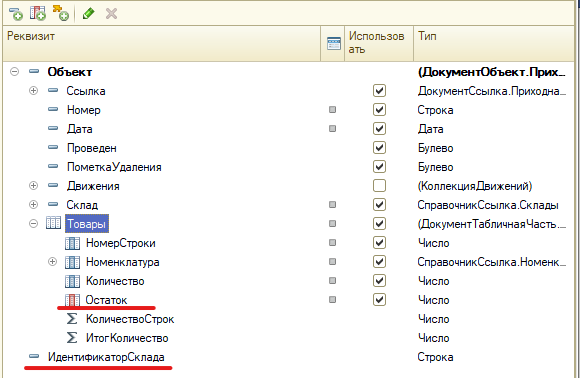
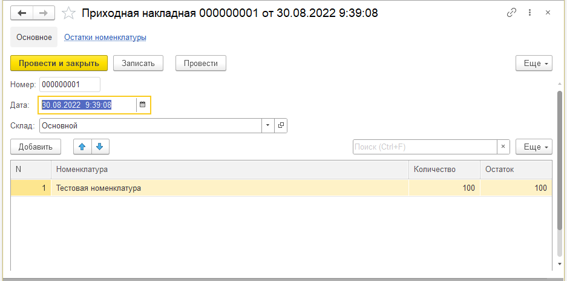
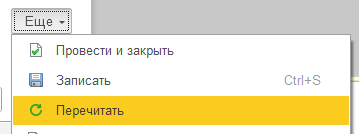
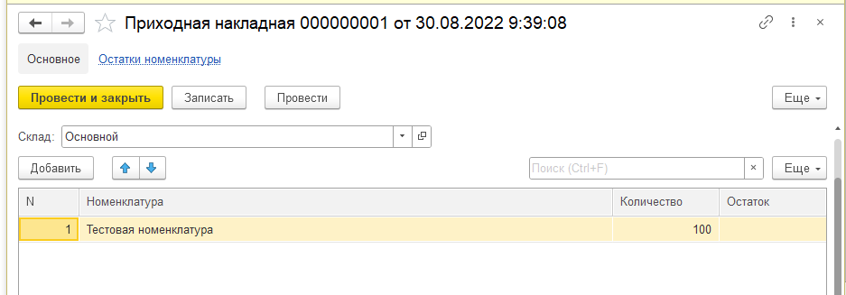

# Разбор ошибок заполнения реквизитов формы объекта (мой топ-3)

Идея статьи родилась в момент исправления очередной ошибки с заполнением реквизитов формы и особенно реквизитов табличных частей. Решил накидать небольшую шпаргалку и отсылаться к ней при необходимости.

## О чём идёт речь?

В 1с есть возможность добавлять на форму дополнительные реквизиты формы (см. скриншот). Цель самая разная: буферизация данных, расширение выводимой информации и тому подобное. К сожалению многие разработчики не сразу продумывают где и как заполнять эти реквизиты, отчего возникают различные неприятные ошибки: как визуальные, так и логические. Далее будет топ-3 самых часто встречаемых ошибок и способ их преодоления.



## Ошибка 1 - Не учитывать, что данные формы могут быть перечитаны

*Задача*: отобразить остатки товара в табличной части документа.

*Быстрокод*: написать обработчик, который получает данные и сделать его вызов в событии `ПриСозданииНаСервере` и `НоменклатураПриИзменении`. И в первом приближении задача кажется решённой - результат же есть.



А дальше пользователь что-то поменял на форме, понял, что ошибся и нажимает кнопку "Перечитать" и колонка очищается.





Что делать? Прописать обновление не только в обработчик `ПриСозданииНаСервере`, но и в `ПриЧтенииНаСервере`. Теоретическая часть зачем? и почему? уже достаточно раскрыта на просторах интернета, поэтому просто посмотрим, что делать на практике.

```bsl
&НаСервере
Процедура ПриСозданииНаСервере(Отказ, СтандартнаяОбработка)

    // если ключ пустой - объект новый и только для него вызываем обработчик 
    Если Параметры.Ключ.Пустая() Тогда
        ОбновитьОстатки();
    КонецЕсли;

КонецПроцедуры

&НаСервере
Процедура ПриЧтенииНаСервере(ТекущийОбъект)

    // а тут и так всё отработает только для объектов базы данных
    ОбновитьОстатки();

КонецПроцедуры
```

### Расширенный вариант

 Обычно реквизитов формы не 1 и не 2 и их так или иначе надо заполнять, поэтому в типовых делают так - общий обработчик ПриСозданииПриЧтенииНаСервере и потом его вызов:

```bsl
&НаСервере
Процедура ПриСозданииНаСервере(Отказ, СтандартнаяОбработка)

    Если Параметры.Ключ.Пустая() Тогда
        ПриСозданииПриЧтенииНаСервере();
    КонецЕсли;

КонецПроцедуры

&НаСервере
Процедура ПриЧтенииНаСервере(ТекущийОбъект)

    ПриСозданииПриЧтенииНаСервере();

КонецПроцедуры

&НаСервере
Процедура ПриСозданииПриЧтенииНаСервере()

    ОбновитьОстатки();

КонецПроцедуры
```

## Ошибка 2 - Не учитывать нюансы передачи между клиентом и сервером при записи объекта

*Задача*: отобразить остатки товара в табличной части документа.

*Быстрокод*: помятуя про ошибку 1 написал всё в `ПриСозданииНаСервере` и `ПриЧтенииНаСервере`.

*Результат*: всё будет хорошо, до тех пор, пока пользователь не нажмёт кнопку "Записать". Результатом опять будет пустая колонка.

Тут всё таки в двух словах поясню. Передача параметров с клиента на сервер происходит через **копирование данных** (см. раздел [ИТС: Вызов с передачей управления с клиента на сервер](https://its.1c.ru/db/v8321doc#bookmark:dev:TI000000153)). В нашем случае происходит копирование в обработчике `ПередЗаписьюНаСервере` `Объект` выгружается в `ТекущийОбъект`, потом `ПослеЗаписиНаСервере` `Объект` заполняется из `ТекущийОбъект`. Отсюда и вылезает ошибка, ведь в `ТекущийОбъект` нашей колонки нет и она останется заполнена данными по умолчанию, т.е. нулями.

Что делать? Чтобы не допустить данной ошибки достаточно вызвать заполнение остатков ещё и после записи:

```bsl
&НаСервере
Процедура ПослеЗаписиНаСервере(ТекущийОбъект)
    ОбновитьОстатки();
КонецПроцедуры
```

Пара примечаний:

Во-первых, не стоит расширять и делать мега обработчик `ПриСозданииПриЧтенииПослеЗаписи`, т.к. всё-таки набор вызываемых функций тут в 99% случаев будет разный.

Во-вторых, такое заполнение касается только дополнительных реквизитов **объекта**. Н-р: перезаполнять отдельные реквизиты формы в общем случае нет необходимости - они сохраняют своё значение, пока открыта форма.

Случай из практики

> Интересное следствие из данной ошибки. Недавно была задача - запоминать определённым образом изменённые строки вплоть до записи объекта. Сделал служебный флаг СтрокаИзменена и при редактировании руками устанавливал его в Истина. Так вот благодаря этой особенности сбрасывать флаг после записи не было нужды, т.к. он сбросится автоматом.

## Ошибка 3 - Не учитывать что у нового объекта реквизиты могут быть заполнены*

*Примечание*: надо сказать, что эта ситуация более редкая, чем предыдущие 2, но и она встречается.

*Задача*: необходимо в реквизит формы получать `ИдентификаторСклада` для какой-то бизнес-логики.

*Быстрокод*: Один из вариантов решения выглядит так:

```bsl
&НаСервере
Процедура ЗаполнитьИдентификаторСклада()

    Если НЕ Параметры.Ключ.Пустая() Тогда
        ИдентификаторСклада = ПолучитьИдентификаторСклада();
    Иначе
        ИдентификаторСклада = "";
    КонецЕсли;

КонецПроцедуры
```

*Результат*: всё будет хорошо, пока пользователь не скопирует документ. В этот момент объект будет новый, но поле склад может быть заполнено, ведь объект создаёт копированием.Поэтому при реализации подобного рода обработчиков лучше всегда контролировать заполнение конкретного реквизита, а не на новый объект или нет.

```bsl
&НаСервере
Процедура ЗаполнитьИдентификаторСклада()

    Если ЗначениеЗаполнено(Объект.Склад) Тогда
        ИдентификаторСклада = ПолучитьИдентификаторСклада();
    Иначе
        ИдентификаторСклада = "";
    КонецЕсли;

КонецПроцедуры
```

### А вы знали?

А вы знали, что при открытии формы нового объекта вызывается обработчик объекта `ОбработкаЗаполнения`, в которую можно и даже нужно положить логику заполнения документа по-умолчанию.

см. рекомендации [Где описать собственный алгоритм заполнения реквизитов нового документа?](https://its.1c.ru/db/metod8dev/content/4149/hdoc)

## Заключение

Ну вот и всё, о чём хотелось рассказать на этот раз. Проблемы вроде бы тривиальные, но на них же очень часто и горят многие разработчики, даже и опытные, но которые не так часто работают с формами.

Спасибо за то, что уделили внимание моим запискам. С уважением, Вдовенко Сергей.
