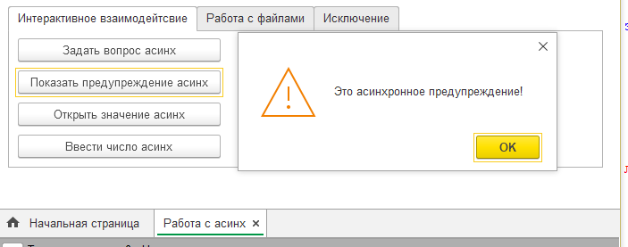
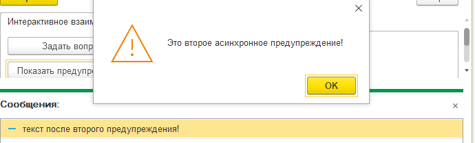
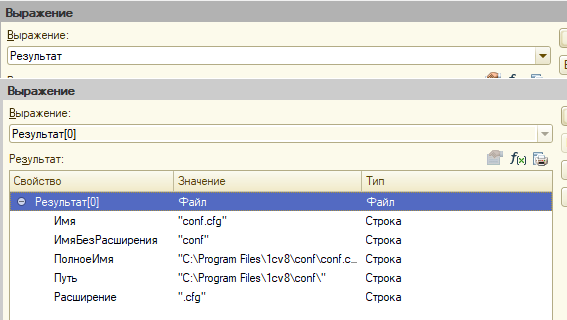
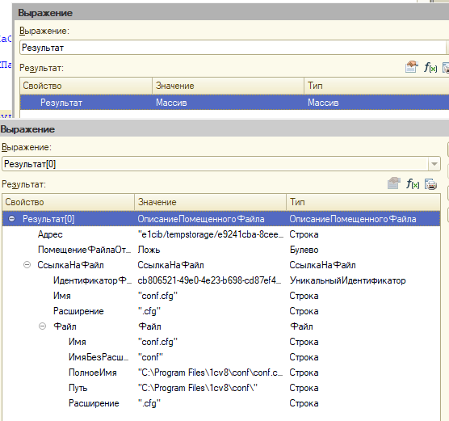

# Шпаргалка по функциям АСИНХ

При знакомстве с новой механикой работы с асинхронностью (обещание, ждать и асинх) делал пометки, которыми и хочу поделиться. Ничего сверхъестественного в них нет, просто небольшие примеры и некоторые всплывшие нюансы использования.

## Вводное слово

С платформы 8.3.18 появилась новая механика работы с асинхронностью - обещание. Детально останавливаться на описании механизма не вижу смысла - это прекрасно разобрано в статьях от [wonderland.v8.1c.ru](https://wonderland.v8.1c.ru/blog/uluchsheniya-v-sintaksise-yazyka-1s-dlya-raboty-s-asinkhronnymi-funktsiyami/) и статья от [курсы-по-1с](https://курсы-по-1с.рф/news/async-metods-article/). Тут же вставлю только несколько тезисов:

- Сам механизм асинхронности не изменился - изменился и упростился способ работы с ними
- Основная соль нового механизма - объект типа `Обещание`. Все новые асинхронный функции возвращают данный объект. `Обещание` имеет 3 состояния: `Ожидание`, `Успех`, `Провал`.
- Новый метод `Ждать`, аргументом которого является `Обещание`. Суть метода - ожидать завершения асинхронной функции не продолжая - выполнение кода.
- Вызов новых асинхронных методов встроенного языка возможен только внутри асинхронных процедур и функций
- Все новые асинхронные функции - есть аналоги старых асинхронных функций: `Вопрос` - `ПоказатьВопрос` - `ВопросАсинх`, `Предупреждение` - `ПоказатьПредупреждение` - `ПредупреждениеАсинх`, и т.д.

Все эксперименты проводятся на платформе 8.3.20.16.13

## Примеры интерактивного взаимодействия

### ПредупреждениеАсинх

`ПредупреждениеАсинх` - новый синтаксис предупреждения. Ожидание обещания возвращает `Неопределено`.

```bsl
&НаКлиенте
Асинх Процедура Демо_ПоказатьПредупреждениеАсинх()
    
    текст = НСтр("ru='Это асинхронное предупреждение!'");
    
    Обещание = ПредупреждениеАсинх(текст);
    Результат = Ждать Обещание; // тут выполнение остановится пока не закроется предупреждение
    
    текст = НСтр("ru='Это второе асинхронное предупреждение!'");
    ПредупреждениеАсинх(текст); // предупреждение выведется и, но код пойдёт исполняться дальше

    Сообщение = Новый СообщениеПользователю;
    Сообщение.Текст = НСтр("ru='текст после второго предупреждения!'");;
    Сообщение.Сообщить();

КонецПроцедуры
```

Первое предупреждение - выполнение остановилось.


Второе предупреждение - выполнение не остановилось (см. всплывшее сообщение)


### ВопросАсинх

`ВопросАсинх` - новый синтаксис вопроса. Ожидание обещания возвращает `КодВозвратаДиалога`.

```bsl
&НаКлиенте
Асинх Процедура Демо_ЗадатьВопросАсинх()

    обещание = ВопросАсинх(НСтр("ru='Купить слона?'"), РежимДиалогаВопрос.ДаНет, , КодВозвратаДиалога.Да);
    Результат = Ждать обещание; // тут выполнение остановится пока пользователь не ответит на вопрос
    
    Если Результат = КодВозвратаДиалога.Да Тогда
        текст = НСтр("ru='Ответ утвержительный!'");
    ИначеЕсли Результат = КодВозвратаДиалога.Нет Тогда 
        текст = НСтр("ru='Ответ отрицательный!'");
    Иначе
        текст = НСтр("ru='Ответ не получен!'");
    КонецЕсли;
    
КонецПроцедуры
```

### ОткрытьЗначениеАсинх

`ОткрытьЗначениеАсинх` - новый синтаксис показа значения. Ожидание обещания возвращает `Неопределено`.

```bsl
&&НаКлиенте
Асинх Процедура Демо_ОткрытьЗначениеАсинх()
    
    тестовыйСписок = Новый СписокЗначений;
    тестовыйСписок.Добавить("тест1", "тестовое значение 1");
    тестовыйСписок.Добавить("тест2", "тестовое значение 2");
    тестовыйСписок.Добавить("тест3", "тестовое значение 3");
    
    Обещание = ОткрытьЗначениеАсинх(тестовыйСписок);
    Результат = Ждать Обещание; // тут выполнение остановится пока список не закроется
    
КонецПроцедуры
```

### ВвестиЧислоАсинх

`ВвестиЧислоАсинх` - новый синтаксис ввода числа. Ожидание обещания возвращает `Число`.

```bsl
&&НаКлиенте
Асинх Процедура Демо_ВвестиЧислоАсинх()
    
    Обещание = ВвестиЧислоАсинх(1, НСтр("ru='укажите любое число!'"));
    Результат = Ждать Обещание;
        
КонецПроцедуры
```

## Примеры работы с файлами

### НайтиФайлыАсинх

`НайтиФайлыАсинх` - новый синтаксис поиска файлов. Ожидание обещания возвращает массив объектов, типа `Файл`.

```bsl
&НаКлиенте
Асинх Процедура Демо_НайтиФайлыАсинх()
    
    ПутьКПапкеСФайлами = "C:\Program Files\1cv8\conf";
    Обещание = НайтиФайлыАсинх(ПутьКПапкеСФайлами, "*.*", Ложь);
    Результат = Ждать Обещание;
        
КонецПроцедуры
```

Пример, что возвращается внутри результата


### ПоместитьФайлыНаСерверАсинх

`ПоместитьФайлыНаСерверАсинх` - новый синтаксис помещения файлов на сервер. Ожидание обещания возвращает массив объектов, типа `ОписаниеПомещенногоФайла` - если успех, либо `Неопределено` - если провал.

```bsl
&НаКлиенте
Асинх Процедура Демо_ПоместитьФайлыНаСерверАсинх(Команда)
    
    ПутьКПапкеСФайлами = "C:\Program Files\1cv8\conf";
    Обещание = НайтиФайлыАсинх(ПутьКПапкеСФайлами, "*.*", Ложь);
    Результат = Ждать Обещание;

    ДобавляемыеФайлы = Новый Массив;
    Для каждого НайденныйФайл из Результат Цикл
    
        ОписаниеДобавляемогоФайла = Новый ОписаниеПередаваемогоФайла;
        ОписаниеДобавляемогоФайла.Имя = НайденныйФайл.ПолноеИмя;
        ДобавляемыеФайлы.Добавить(ОписаниеДобавляемогоФайла);
    
    КонецЦикла;

    Обещание = ПоместитьФайлыНаСерверАсинх(,,ДобавляемыеФайлы, ЭтаФорма.УникальныйИдентификатор);    
    Результат = Ждать Обещание;

КонецПроцедуры
```

Пример, что возвращается внутри результата


## Нюансы использования

### Асинхронные обработчики команд

как уже говорилось ранее, использование новых методов языка возможно только внутри асинхронных методов (ключевое слово - Асинх). Вопрос - а можно ли сделать обработчик команды асинхронным? Ответ: Да можно - никаких проблем тут нет.

```bsl
// это обработчик команды
&НаКлиенте
Асинх Процедура Демо_ВвестиЧислоАсинх(Команда)
    
    Обещание = ВвестиЧислоАсинх(1, НСтр("ru='укажите любое число!'"));
    Результат = Ждать Обещание;
    
    ВывестиПараметрыПеременной(Результат);
    
КонецПроцедуры
 ```

### Работа с исключениями

Любая асинхронная функция в момент входа тут же возвращает Обещание. Обещание имеет статус: Ожидание. Если при выполнении асинхронной функции возникнет исключение и оно не будет перехвачено - ошибка останется незамеченной. Код ниже выполняется без каких-либо предупреждений.

```bsl
&НаКлиенте
Процедура Демо_ПоявлениеИсключенияСинх(Команда)
    
    ВызватьОшибку();
    
КонецПроцедуры

&НаКлиенте
Асинх Функция ВызватьОшибку()
    
    ВызватьИсключение НСтр("ru='ошибка: слон не обнаружен!'");    
    
КонецФункции
```

А если сделать эту функцию асинхронной, тогда исключение выведется пользователю. И тут уже можно написать и попытку / исключение для перехвата и обработки исключения.

```bsl
&НаКлиенте
Асинх Процедура Демо_ПоявлениеИсключенияСинх(Команда)
    
    ВызватьОшибку();
    
КонецПроцедуры
```

### Асинхронные обработчики событий формы

Как вы думаете, откроется ли форма, если подключить обработчик события и написать следующий код?

```bsl
&НаКлиенте
Асинх Процедура ПриОткрытии(Отказ)
    
    Отказ = Истина;
    ВызватьИсключение НСтр("ru='ошибка: слон не обнаружен!'");
    МатОшибка = 1 / 0;
    
КонецПроцедуры
```

Ответ: да, откроется, поэтому в данном случае использовать `Асинх` не стоит. Собственно об этом говориться на wonderland.v8.1c.ru:

> если при выполнении Асинх процедуры возникнет не перехваченное исключение, то это приведет к выдаче пользователю сообщения об ошибке. Само это исключение никак не может быть перехвачено и обработано вызвавшим процедуру кодом.

### Вопросы при открытии и при закрытии формы

Логика работы с вопросами при открытии (и при закрытии) в данном случае остаётся той же, что и раньше с поправкой на новый механизм и упрощение синтаксиса

```bsl
&НаКлиенте
Процедура ПриОткрытииВопрос(Отказ)
    
    ЗадатьВопросАсинх_ПриОткрытии();
    
КонецПроцедуры

&НаКлиенте
Асинх Процедура ЗадатьВопросАсинх_ПриОткрытии()
    
    обещание = ВопросАсинх(НСтр("ru='Купить слона?'"), РежимДиалогаВопрос.ДаНет, , КодВозвратаДиалога.Да);
    Результат = Ждать обещание; 
    
    Если Результат <> КодВозвратаДиалога.Да Тогда 
        ЭтаФорма.Закрыть();
    КонецЕсли;
    
КонецПроцедуры
```

Пример вопрос при закрытии формы

```bsl
&НаКлиенте
Перем ВопросПриЗакрытииЗадан;

&НаКлиенте
Процедура ПередЗакрытием(Отказ, ЗавершениеРаботы, ТекстПредупреждения, СтандартнаяОбработка)
    
    Если НЕ ВопросПриЗакрытииЗадан Тогда
        ЗадатьВопросАсинх_ПриЗакрытии();
        Отказ = Истина;
    КонецЕсли;
    
КонецПроцедуры

&НаКлиенте
Асинх Процедура ЗадатьВопросАсинх_ПриЗакрытии()
    
    обещание = ВопросАсинх(НСтр("ru='Продать слона?'"), РежимДиалогаВопрос.ДаНет, , КодВозвратаДиалога.Да);
    Результат = Ждать обещание; 
    
    Если Результат = КодВозвратаДиалога.Да Тогда 
        // ВопросПриЗакрытииЗадан = Истина; // если надо спрашивать пока не согласиться
        ЭтаФорма.Закрыть();
    КонецЕсли;
    
    ВопросПриЗакрытииЗадан = Истина;
    
КонецПроцедуры

ВопросПриЗакрытииЗадан = Ложь;
```

### Последовательность выполнения нескольких функций

Тут я сам ничего выдумывать не буду и отсылаю вас к прекраснейшей статье Александра Быкова - [Семеро одного не ждут? Асинхронное исследование асинхронности](https://infostart.ru/1c/articles/1454459/)

## Развитие механизма

В платформе 8.3.21 добавились ещё асинхронные методы для HTTP-запросов, но про них сказать пока нечего, ибо не пользовался. На всякий случай приведу список добавленных методов:

- `ВызватьHTTPМетодАсинх`
- `ЗаписатьАсинх`
- `ИзменитьАсинх`
- `ОтправитьДляОбработкиАсинх`
- `ПолучитьАсинх`
- `ПолучитьЗаголовкиАсинх`
- `УдалитьАсинх`

## Заключение

На этом я, пожалуй, и закончу. Целью статьи было показать на практических примерах работу с новым механизмом, рассказать о нюансах, которые, может, сразу в голову и не приходили (например: про асинхронные обработчики команд и формы) и упорядочить эти знания в своей собственной голове. Спасибо за внимание. Дополнительные источники, которые можно почитать на тему, - см. ниже.

Если вдруг кому нужна обработка, в которой я накидывал данные примеры кода - см. мой github

P.S. В ходе тестирования ни один слон не пострадал ^_^

Спасибо за то, что уделили внимание моим запискам. С уважением, Вдовенко Сергей.

## Источники

1. [Улучшения в синтаксисе языка 1С для работы с асинхронными функциями: синхронная асинхронность](https://wonderland.v8.1c.ru/blog/uluchsheniya-v-sintaksise-yazyka-1s-dlya-raboty-s-asinkhronnymi-funktsiyami/)
2. [Расширение поддержки работы с НТТР-запросами](https://wonderland.v8.1c.ru/blog/rasshirenie-podderzhki-raboty-s-nttr-zaprosami/?sphrase_id=311663)
3. [«Асинхронные методы в 1С», статья Василия Ханевича](https://курсы-по-1с.рф/news/async-metods-article/)
4. [Shining_ninja - Синхронный и асинхронный вызов в новых версиях платформы](https://infostart.ru/1c/articles/1595214/)
5. [Александр Быков - Семеро одного не ждут? Асинхронное исследование асинхронности](https://infostart.ru/1c/articles/1454459/)
