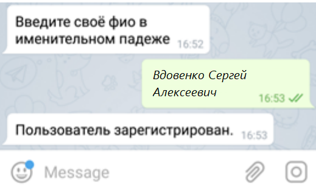

# История развития телеграм-ботов в одной сибирской компании

Хочу рассказать историю развития и применения Telegram-ботов в одной компании. Говорить буду о том, что сделано, а не как сделано. Идея написать об этом возникла, так как, делясь опытом с коллегами, неожиданно обнаружил, что реализованные фичи вызывали немалое удивление, по принципу: "А так можно было?". Надеюсь, мой рассказ будет вам полезен и вдохновит на создание чего-нибудь занятного.

## Краткая вводная

Работал я как-то в одной сибирской компании-дистрибьюторе (2016 - 2021 год). Что есть дистрибуция? Это когда мы закупаем у поставщика паллеты, а продаём коробки и штуки. Польза такого дистрибьютора в том, что он берёт на себя все заморочки с распространением (поиск клиентов, оформление договоров, логистика и т.д.), а поставщик ему за это доплачивает (деньгами, скидками и другими схемами).

В штате дистрибьютора есть специальные люди - торговые представители. Каждый из них имеет определённую зону (территорию), которую должен обслуживать: находить новых клиентов, собирать заявки, выполнять планы продаж, планы по промо и множество других планов и задач. Для этого у них есть при себе планшет. Большие поставщики требуют установку конкретного ПО, а часть помельче оставляет всё на откуп дистрибьютору.

## С чего всё начиналось в далёком 2017 году

Одной из первых бед, которую мы пытались решить - оперативное информирование. Ни у одного из наших поставщиков не было ПО, которое позволило бы очень быстро уведомлять торговые команды о проблемах со сброшенными заказами: не хватило остатка, не сработала акция... А это сразу ряд рисков: отказ от приёмки товара (логистические расходы), репутационные потери, а следом и уменьшение клиентской базы (уменьшение доходов), невыполнение планов поставщика по дистрибуции (потеря бонусов) и так далее.

Покажу задержки на примере одного обмена:

Заказ на планшете (ручной запуск, 2 минуты) -> центральная база поставщика (обмен каждые 5 минут) -> загрузка в 1С (1-5 минут на пакет) -> обработка данных в 1С (1-5 минут) -> выгрузка сообщения с ошибками в базу поставщика (обмен каждые 5 минут) -> ручная! синхронизация для получения сообщения

И давайте прикинем максимальную задержку в этой цепочке: 2 + 5*2 + 3 + 3 + 5*2 + N = 28 + N, где

N - от 10 минут до 12 часов! (когда после оформления последнего на день заказа торговый больше не синхронизируется)
5*2 - это учитываем пограничные синхронизации (запросили пакет до того, как заказ прогрузился в систему клиента)
Для ликвидации этой самой N и было решено использовать какой-нибудь мессенджер. Решали на двоих с моим тогдашним руководителем (Костя, привет!). Выбор пал на telegram ибо у него было самое подробное описание api и можно было без webhook (но это тема для отдельного разговора).

## Первый Telegram-бот

Итак, мессенджер выбран, api на базовом уровне освоено, эксперименты проведены, начинаем продумывать, что вообще нужно реализовать. Основное требование: торговый должен получать сообщения только о своих заказах. Отсюда родилось сразу 2 нюанса реализации:

Требуется сопоставить торговых представителей (физические лица 1с) и пользователя telegram (user_id)
Требуется собирать сообщения об ошибках заказа в единый массив и отсылать их торговому
Для решения первой задачи была придумана простая процедура регистрации. Торговый представитель должен найти в Telegram нашего бота, н-р: @РогаИКопытаБот и пройти простую процедуру регистрации: указать ФИО, по этому ФИО искался пользователь в 1С и если был найден - сохранялся user_id. Если нет - требовали от ответственных завести нужных пользователей в 1С. Знаю, что небезопасное решение, но мы не видели в рассылке сообщений ничего страшного, поэтому решили не усложнять.

Нашёл старые скриншоты, вот как это было

Для решения второй задачи был доработан модуль проверки заказа, чтобы все сообщения регистрировались в специальный регистр сведений "Сообщения telegram " и потом раз в 5 секунд отправлялись.

Эффект проявился почти сразу: торговые получали сообщения о проблемах и могли тут же, на месте, отредактировать заказ, заменив или исключив проблемные позиции.

## Развитие telegram-ботов (2017 - 2019 год)

Решив первую проблему и настроив процесс, бизнес начал втягиваться и просить новый функционал. Вот, что было реализовано за 2 года

### Бот для экспедиторов

Что может случиться с заказом по пути со склада до клиента:

товар может потерять кондицию (помялся, разбился и т.д.)
товар может потеряться полностью
клиент может отказаться от товара (не устроили сроки, не оплатил и т.д.)
Для фиксации всего этого был сделан так же отдельный бот, в который экспедитору подгружались реализации, которые он развозит и экспедитор мог указать причину отказа. Правда 1 причина на заказ, до возможности указать конкретный товар так и не дошли, но и это сильно упростило нам жизнь.

Тут кстати, появилось первое кросс-сообщение (сообщение между двумя ботами). Из телеграм-бота экспедитора уходило уведомление торговому представителю и он мог созвониться с клиентом и уговорить! его принять товар. Ему на это давалось 5-7 минут, потом экспедитор ехал дальше по маршруту. Не поверите, но это иногда даже срабатывало...

### Бот для оформления платежных поручений

Кто в компании собирал деньги? Не знаю, как у других, а у нас это мог быть экспедитор, состоящий в штате компании или торговый представитель. В свете изменений в законодательстве в 2019 году (онлайн-чеки и фискальные накопители), было решено, что экспедиторам выдадут мобильные кассы, а вот торговые должны иметь возможность оформлять ПКО (приходный кассовый ордер) через telegram.

Что было сделано? Торговый мог вбить номер накладной и если по ней ещё не было оплат - мог зарегистрировать приём денег. В 1с на это тут же оформлялся приходный кассовый ордер, который сразу пробивался в онлайн-кассе.

Кстати тут была интересная доработка. По первости электронные чеки никак не хотели уходить клиенту (а точнее приходили с большим опозданием), поэтому выкрутились так: стали получать с пробитого документа фискальные данные, собирали ссылку на этот чек (там по сути был стандартный адрес + ид ФН + ид чека, насколько я помню) и тут же слали её обратной торговому, которые передавал ссылку клиенту и все были спокойны.

### Бот для получения данных об условиях акций

Тут я уже забыл предпосылки, но суть в том, что у нас далеко не все имели доступ в 1с, а какая-то информация из неё была оперативно нужна. В частности быстро посмотреть условия акции. Для этого разработали алгоритм, где люди могли по номеру акции быстро посмотреть её данные.

### Бот для руководства (для краткой информационной рассылки)

Был у нас такой процесс - транспортный отдел в период с 6 до 8 вечера планировал маршруты по сброшенным заявкам. По итогу формировались объёмы: сколько штук (килограмм) куда поедет. После чего транспортный отдел слал СМС-ку руководству об отправляемых объёмах. Мы это заменили на авторассылку в специальный telegram-бот.

## Заведение контрагентов и новых адресов через telegram

Вот тут хочу остановиться подробнее. Это я реализовывал в 2020 году и насколько знаю, развитие функционала на этом и прекратилось.

Как происходила процедура заведения клиента: Торговый представитель собирал с клиента основные данные (Наименование, ИНН) в специальную анкету и передавал их в службу безопасности (СБ). СБ - проводила проверку контрагента (существует вообще такой ИНН или нет, сколько на нём долгов и т.д.) и давал добро на заведение. После чего клиента заводили в 1с, он выгружался на планшет торговому представителю и можно было начинать торговать. Учитываю всю рутину на этот процесс легко уходило 2-3 дня.

Что решено было сделать? Надо научится автоматически запрашивать информацию о контрагенте, хотя бы базовую. Для этого был выбран сервис dadata.ru. API там прост, как 3 копейки, что было отдельным плюсом.

Новая схема заведения клиента выглядит так:

Торговый клиент вбивает ИНН на планшете

ИНН улетает на проверку в DaData и возвращает найденные результаты для подтверждения агенту

и если с ним всё в порядке и не найдено дубликатов - создаётся контрагент и связанная информация в ИБ в спец. папке для таких клиентов, а службе безопасности улетает уведомление на почту, что появился новый клиент

С Адресом все было ещё интереснее:

Торговый выбирает по карте точку, которую он хочет завести

DaData, а она умеет выводить адреса, рядом с переданными гео-координатами, выводит эти адреса торговому на выбор

Торговый вводит ИНН или наименование клиента, к которому нужно привязать адрес

И если всё хорошо - происходит привязка
По замерам, процесс заведения нового клиента ускорился с 2х дней до 10-20 минут (тут мы тормозимся обменами с торговыми программами, которые не событийные, а просто по времени)

## Заключение

Ну вот и всё. Надеюсь данная статься была вам полезна и натолкнула на интересные мысли. Напоследок, выскажу мысль, которая сейчас вертится в голове: если решитесь делать telegram-бота именно на 1С - выносите его в отдельную базу и делайте обмен необходимыми данными. Ибо в ходе развития telegram-бота требовались постоянные доработки, иногда и доработки в метаданных и удобно, когда это в отдельной базе. Плюс телеграм-бот не работал, когда основная база в процессе обновления. Как я выкручивался, это тема отдельного разговора (мой позор, на самом деле -_-). А можно ведь и не в 1с, а на python, например ^_^

Если у вас остались вопросы или хотите, чтобы я подробнее раскрыл какой-то из моментов, может писать их в комментарии, постараюсь ответить.

Спасибо за то, что уделили внимание моим запискам. С уважением, Вдовенко Сергей.
